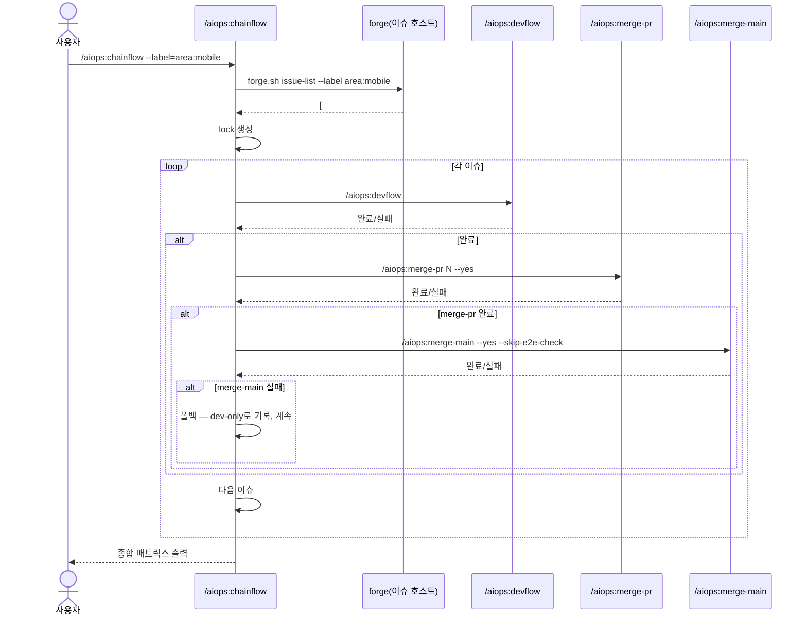

# /aiops:chainflow — 그룹 이슈 순차 자동 처리

복수 이슈를 한 번에 자동 처리. 동일 area/module/phase에 속한 이슈들을 순차적으로 devflow → merge-pr → merge-main 까지 자동 실행.

> **기존 \`/aiops:devflow #N1 #N2\` 배치 모드와의 차이**:
> - 배치 모드: 병렬 (B-2/B-3 기획·기술스펙 동시 호출)
> - 본 스킬: 순차 (이슈 #N1 머지까지 완료 후 #N2 시작)
> - 본 스킬: dev/main 머지까지 자동 연결 (devflow 단독은 STEP 10에서 종료)

> **forge 도구 규약**: 이슈/PR 조작은 `gh` 대신 forge 중립 헬퍼 `forge.sh`(origin 리모트로 GitHub↔Gitea 자동감지)를 **실행**한다. 문서에선 `forge.sh <sub>` 로 표기하지만 실제 호출은 항상 절대경로 실행형이다: `bash "${CLAUDE_PLUGIN_ROOT}/scripts/forge.sh" <sub> ...` (소싱 금지). forge.sh 는 origin 자동감지라 `--repo` 가 불필요하고, 인증(Gitea 토큰/CF Access)도 forge.sh 가 처리한다.

---

## 1. 인자 파싱

| 인자 | 의미 | 예시 |
|------|------|------|
| `--label=<k:v>` | 라벨 필터 | `--label=area:auth` |
| `--milestone=<n>` | 마일스톤 (이름 또는 번호) | `--milestone="v1.0"` |
| `--title-tag=<tag>` (#182) | 제목 대괄호 태그 매칭 | `--title-tag=mobile` → `[mobile]` 포함 |
| `--title-prefix=<p>` (#182) | 시작 prefix 매칭 | `--title-prefix='feat(auth):'` |
| `--title-pattern=<re>` (#182) | 제목 정규식 매칭 | `--title-pattern='^\[P[12]\]'` |
| `--title-contains=<s>` (#182) | 제목 부분 문자열 | `--title-contains=login` |
| `#N1 #N2 #N3` | 명시 이슈 번호 (정렬 순서대로) | `#5 #6 #7` |
| `--order=<o>` | 정렬 (number-asc/desc, created-asc/desc) | `--order=number-asc` |
| `--yes` / `-y` | 시작 확인 건너뜀 (기본 활성 — 본 스킬은 자동) | |
| `--dry-run` | 시뮬레이션 (PR 생성/머지 없음) | |
| `--no-merge-main` | merge-main 시도하지 않음 (dev 머지까지만) | |
| `--no-merge-pr` | merge-pr 시도하지 않음 (devflow만) | |
| `--continue-on-fail` | 실패 이슈 건너뜀 (기본 활성) | |

```bash
ARG_LABEL=$(grep -oE -- '--label=[^ ]+' <<<"$ARGUMENTS" | head -1 | cut -d= -f2)
ARG_MILESTONE=$(grep -oE -- '--milestone=[^ ]+' <<<"$ARGUMENTS" | head -1 | cut -d= -f2)

# #182: 제목 기반 필터 4종
ARG_TITLE_TAG=$(grep -oE -- '--title-tag=[^ ]+' <<<"$ARGUMENTS" | head -1 | cut -d= -f2)
ARG_TITLE_PREFIX=$(grep -oE -- "--title-prefix='[^']+'|--title-prefix=[^ ]+" <<<"$ARGUMENTS" | head -1 | sed "s/^--title-prefix=//;s/^'//;s/'$//")
ARG_TITLE_PATTERN=$(grep -oE -- "--title-pattern='[^']+'|--title-pattern=[^ ]+" <<<"$ARGUMENTS" | head -1 | sed "s/^--title-pattern=//;s/^'//;s/'$//")
ARG_TITLE_CONTAINS=$(grep -oE -- "--title-contains='[^']+'|--title-contains=[^ ]+" <<<"$ARGUMENTS" | head -1 | sed "s/^--title-contains=//;s/^'//;s/'$//")

ARG_ORDER=$(grep -oE -- '--order=[a-z-]+' <<<"$ARGUMENTS" | head -1 | cut -d= -f2)
ARG_ORDER="${ARG_ORDER:-number-asc}"
ARG_DRY=$(grep -qE -- '--dry-run' <<<"$ARGUMENTS" && echo true || echo false)
ARG_NO_MERGE_MAIN=$(grep -qE -- '--no-merge-main' <<<"$ARGUMENTS" && echo true || echo false)
ARG_NO_MERGE_PR=$(grep -qE -- '--no-merge-pr' <<<"$ARGUMENTS" && echo true || echo false)

# 명시 이슈 번호 추출
EXPLICIT_ISSUES=($(grep -oE '#?[0-9]+' <<<"$ARGUMENTS" | tr -d '#'))
```

## 2. 이슈 목록 수집

### 2.1 우선순위
1. 명시 이슈 번호 (`#N1 #N2 #N3`) → 입력 순서 그대로
2. `--label` / `--milestone` → gh API 1차 필터
3. `--title-*` (#182) → 1차 결과(또는 전체 open)에서 제목 필터 (AND)
4. 다중 선택 인자는 AND 조합

### 2.2 수집 로직

```bash
ISSUES=()

if [[ ${#EXPLICIT_ISSUES[@]} -gt 0 ]]; then
  ISSUES=("${EXPLICIT_ISSUES[@]}")
  SOURCE="explicit"
else
  # 라벨/마일스톤 1차 필터 (없으면 전체 open)
  # forge.sh issue-list 는 "<번호>\t<제목>" 라인을 출력 (eval 조립 대신 배열 인자로 안전 전달)
  FORGE_ARGS=(--state open)
  [[ -n "$ARG_LABEL" ]]     && FORGE_ARGS+=(--label "$ARG_LABEL")
  [[ -n "$ARG_MILESTONE" ]] && FORGE_ARGS+=(--milestone "$ARG_MILESTONE")

  RAW=$(forge.sh issue-list "${FORGE_ARGS[@]}")   # 각 줄: <number><TAB><title>

  # 제목 기반 2차 필터 (#182) — TSV 2번째 필드(제목)에 적용
  FILTERED="$RAW"
  if [[ -n "$ARG_TITLE_TAG" ]]; then
    # [tag] 패턴 (대괄호) 부분 매칭
    FILTERED=$(echo "$FILTERED" | awk -F'\t' -v t="[$ARG_TITLE_TAG]" 'index($2,t)')
  fi
  if [[ -n "$ARG_TITLE_PREFIX" ]]; then
    # startswith
    FILTERED=$(echo "$FILTERED" | awk -F'\t' -v p="$ARG_TITLE_PREFIX" 'substr($2,1,length(p))==p')
  fi
  if [[ -n "$ARG_TITLE_PATTERN" ]]; then
    # 정규식 (awk ERE)
    FILTERED=$(echo "$FILTERED" | awk -F'\t' -v re="$ARG_TITLE_PATTERN" '$2 ~ re')
  fi
  if [[ -n "$ARG_TITLE_CONTAINS" ]]; then
    # 부분 문자열 (대소문자 무시)
    FILTERED=$(echo "$FILTERED" | awk -F'\t' -v s="${ARG_TITLE_CONTAINS,,}" 'index(tolower($2),s)')
  fi

  ISSUES=($(echo "$FILTERED" | awk -F'\t' 'NF{print $1}'))

  # SOURCE 라벨링
  SOURCES=()
  [[ -n "$ARG_LABEL" ]]          && SOURCES+=("label:$ARG_LABEL")
  [[ -n "$ARG_MILESTONE" ]]      && SOURCES+=("milestone:$ARG_MILESTONE")
  [[ -n "$ARG_TITLE_TAG" ]]      && SOURCES+=("title-tag:$ARG_TITLE_TAG")
  [[ -n "$ARG_TITLE_PREFIX" ]]   && SOURCES+=("title-prefix:$ARG_TITLE_PREFIX")
  [[ -n "$ARG_TITLE_PATTERN" ]]  && SOURCES+=("title-pattern:$ARG_TITLE_PATTERN")
  [[ -n "$ARG_TITLE_CONTAINS" ]] && SOURCES+=("title-contains:$ARG_TITLE_CONTAINS")
  SOURCE=$(IFS=" AND "; echo "${SOURCES[*]}")
  [[ -z "$SOURCE" ]] && { echo "[chainflow] ERROR: 이슈 선택 인자 필요"; exit 2; }
fi

# 정렬
case "$ARG_ORDER" in
  number-asc)   ISSUES=($(printf '%s\n' "${ISSUES[@]}" | sort -n)) ;;
  number-desc)  ISSUES=($(printf '%s\n' "${ISSUES[@]}" | sort -nr)) ;;
  created-asc|created-desc)
    # created 기준 정렬 (forge.sh issue-list 는 기본 최신순 반환 — 번호 근사 정렬로 폴백)
    ;;
esac

if [[ ${#ISSUES[@]} -eq 0 ]]; then
  echo "[chainflow] 이슈 0건 — 종료"
  exit 0
fi

TOTAL=${#ISSUES[@]}
echo "[chainflow] $TOTAL건 이슈 발견 (source=$SOURCE): ${ISSUES[*]}"
```

## 3. Chain lock (#176 연동)

체인 시작 시 `.claude/.chainflow.lock` 작성. 이는 `.devflow.lock` 과 별개 또는 통합 가능.

```bash
mkdir -p .claude
trap 'rm -f .claude/.chainflow.lock' EXIT INT TERM

cat > .claude/.chainflow.lock <<EOF
{
  "workflow": "chainflow",
  "source": "$SOURCE",
  "issues": [$(IFS=,; echo "${ISSUES[*]}")],
  "total": $TOTAL,
  "current_index": 0,
  "current_issue": ${ISSUES[0]},
  "started_at": "$(date -u +%FT%TZ)",
  "results": {},
  "pid": $$
}
EOF
```

## 4. 시작 안내 (--yes 기본)

본 스킬은 자동 진행이 기본이지만, 시작 시 1회 요약을 stdout에 출력하고 (가장 첫 이슈 표) 이슈에 trace 댓글(`forge.sh issue-comment`)을 남긴다:

```markdown
## ⛓️ Chainflow 시작

- 출처: label:area:mobile
- 정렬: number-asc
- 이슈: 7건 (#181, #182, ..., #187)
- merge-pr: 활성
- merge-main: 활성 (실패 시 폴백)
- 시작 시각: 2026-06-19T19:00:00Z
```

각 이슈의 첫 댓글로 등록 (또는 별도 chain tracking 이슈).

## 5. 순차 실행 루프

```bash
declare -A RESULTS

for i in "${!ISSUES[@]}"; do
  ISSUE="${ISSUES[$i]}"
  IDX=$((i + 1))

  echo ""
  echo "=================================================="
  echo "## ⛓️ 이슈 #$ISSUE 시작 ($IDX/$TOTAL)"
  echo "=================================================="

  # 5.1 lock 갱신
  jq --argjson idx "$i" --argjson cur "$ISSUE" \
    '.current_index = $idx | .current_issue = $cur' \
    .claude/.chainflow.lock > .claude/.chainflow.lock.tmp \
    && mv .claude/.chainflow.lock.tmp .claude/.chainflow.lock

  # 5.2 devflow
  if [[ "$ARG_DRY" == "true" ]]; then
    echo "[dry-run] /aiops:devflow #$ISSUE 시뮬레이션"
    RESULTS[$ISSUE]="DRY-RUN"
    continue
  fi

  # /aiops:devflow 실행 (서브셸 또는 Skill 호출)
  /aiops:devflow "#$ISSUE" || {
    echo "[chainflow] ⚠️ /aiops:devflow #$ISSUE 실패"
    RESULTS[$ISSUE]="FAIL:devflow"
    # 실패 이슈 건너뛰고 계속 (Q2)
    forge.sh issue-comment "$ISSUE" "## ⛓️ Chainflow — devflow 실패, 다음 이슈로 진행" >/dev/null 2>&1
    continue
  }

  # 5.3 merge-pr (--no-merge-pr가 아닐 때)
  if [[ "$ARG_NO_MERGE_PR" != "true" ]]; then
    /aiops:merge-pr "$ISSUE" --yes || {
      echo "[chainflow] ⚠️ /aiops:merge-pr #$ISSUE 실패 — 다음 이슈로 진행"
      RESULTS[$ISSUE]="FAIL:merge-pr"
      forge.sh issue-comment "$ISSUE" "## ⛓️ Chainflow — merge-pr 실패, 다음 이슈로 진행" >/dev/null 2>&1
      continue
    }
  fi

  # 5.4 merge-main (--no-merge-main 아닐 때, --skip-e2e-check 권장)
  MERGE_MAIN_OK=true
  if [[ "$ARG_NO_MERGE_MAIN" != "true" ]]; then
    /aiops:merge-main --yes --skip-e2e-check || {
      echo "[chainflow] ⚠️ /aiops:merge-main 실패 — 폴백: dev 머지로 진행 (Q4)"
      MERGE_MAIN_OK=false
    }
  fi

  if [[ "$MERGE_MAIN_OK" == "true" ]]; then
    RESULTS[$ISSUE]="OK:full"
  else
    RESULTS[$ISSUE]="OK:dev-only"
  fi
done
```

## 6. 종합 매트릭스 출력

```bash
echo ""
echo "=================================================="
echo "## ⛓️ Chainflow 종료"
echo "=================================================="
echo ""
echo "| 이슈 | 상태 | 비고 |"
echo "|------|------|------|"
for ISSUE in "${ISSUES[@]}"; do
  STATUS="${RESULTS[$ISSUE]:-UNKNOWN}"
  case "$STATUS" in
    OK:full)       echo "| #$ISSUE | ✅ 완료 (main) | devflow + merge-pr + merge-main |" ;;
    OK:dev-only)   echo "| #$ISSUE | ⚠️ dev만 | merge-main 실패 — 폴백 진행 |" ;;
    FAIL:devflow)  echo "| #$ISSUE | ❌ devflow 실패 | 건너뜀 |" ;;
    FAIL:merge-pr) echo "| #$ISSUE | ❌ merge-pr 실패 | 건너뜀 |" ;;
    DRY-RUN)       echo "| #$ISSUE | 🧪 dry-run | — |" ;;
    *)             echo "| #$ISSUE | ❓ $STATUS | — |" ;;
  esac
done

# 종합 dev → main 시도 (개별 merge-main 실패한 dev-only 이슈들 일괄)
DEV_ONLY_COUNT=$(printf '%s\n' "${RESULTS[@]}" | grep -c "OK:dev-only" || echo 0)
if [[ "$DEV_ONLY_COUNT" -gt 0 && "$ARG_NO_MERGE_MAIN" != "true" ]]; then
  echo ""
  echo "[chainflow] ℹ️ dev-only 이슈 ${DEV_ONLY_COUNT}건 — /aiops:merge-main 일괄 재시도 가능"
  echo "             수동 실행: /aiops:merge-main --yes --skip-e2e-check"
fi
```

## 7. /aiops:devflow 배치 모드 vs /aiops:chainflow

| 항목 | /aiops:devflow #N1 #N2 (배치) | /aiops:chainflow (순차) |
|------|----------------------|-------------------|
| 처리 방식 | 병렬 | 순차 |
| STEP 2~3 (기획/스펙) | 한 번에 N개 동시 호출 | 이슈마다 따로 |
| STEP 4~10 | 이슈별 순차 (Docker 충돌 방지) | 이슈별 순차 |
| 머지 단계 | 없음 (사용자 수동) | 자동 (merge-pr + merge-main) |
| 자동화 범위 | STEP 0~10 | STEP 0~10 + 머지 |
| 사용 시점 | 독립 이슈를 빠르게 산출 | 동일 area/module/phase 연쇄 처리 |

## 8. 시퀀스 다이어그램



## 9. 의존 정보

- 인터페이스: `/aiops:devflow`, `/aiops:merge-pr`, `/aiops:merge-main`
- lock: `.claude/.chainflow.lock` (#176 패턴 확장)
- 산출물 헤더: `## ⛓️ Chainflow 시작`, `## ⛓️ Chainflow — devflow 실패`, `## ⛓️ Chainflow 종료`

## 10. 사용 예시

```bash
# 라벨 기반
/aiops:chainflow --label=area:mobile

# 마일스톤
/aiops:chainflow --milestone="v1.0" --order=number-asc

# 명시 번호
/aiops:chainflow #181 #182 #183

# 제목 태그 (#182) — "[mobile] ..." 제목
/aiops:chainflow --title-tag=mobile

# 제목 prefix (#182) — conventional commits 스타일
/aiops:chainflow --title-prefix='feat(auth):'

# 제목 정규식 (#182) — "[P1]" 또는 "[P2]" 우선순위
/aiops:chainflow --title-pattern='^\[P[12]\]'

# 제목 부분 문자열 (#182)
/aiops:chainflow --title-contains=migration

# AND 조합 (#182) — area:mobile 라벨 + 제목에 [iOS]
/aiops:chainflow --label=area:mobile --title-tag=iOS

# 마일스톤 + 제목 P1 우선 (#182)
/aiops:chainflow --milestone="v1.0" --title-pattern='\[P1\]'

# dev만 (main 승격 X)
/aiops:chainflow --label=phase:1 --no-merge-main

# 시뮬레이션
/aiops:chainflow --label=area:auth --dry-run

# CI 환경
/aiops:chainflow --label=auto-fix --yes
```

---

현재 제공된 인자: $ARGUMENTS

위 절차대로 진행해줘.
