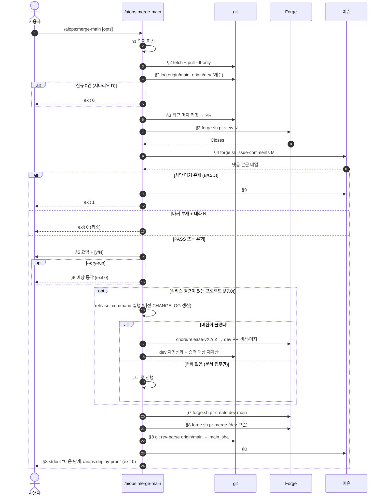

dev 브랜치를 main 으로 자동 머지합니다.

> **이 스킬은 dev → main 승격 + 자동 머지를 한 번에 수행합니다.**
> 가장 최근 dev 머지 이슈의 #119 마커 매트릭스(`## 🌐 Dev E2E 결과 — full` + `E2E_RESULT=PASS`) 가 모두 만족되어야 진행합니다. 차단 마커가 1건이라도 있으면 머지하지 않습니다. 단, `## ℹ️ 헬스체크 스킵`(platform=cli, #42) 마커가 있으면 배포 대상이 없다는 뜻이므로 이 E2E 게이트를 면제하고 진행합니다.

> **issue-N → dev 머지는 `/aiops:merge-pr` 를 사용하세요.** 본 스킬은 dev → main 만 다룹니다.

---

## 0. 헬퍼 함수 (본문 진입 전 선언)

```bash
_block_and_exit() {
  local REASON="$1"      # 사유 코드 (§9 매트릭스)
  local QUOTE="$2"       # grep 매칭된 인용 (없으면 빈 문자열)
  local ACTION="$3"      # 다음 액션 가이드

  local ISSUE_REF="${RECENT_ISSUE:-N/A}"
  local BODY="## 🛑 main 머지 차단

- 사유: \`$REASON\`
- 검사된 이슈: #${ISSUE_REF}
- 인용 마커: \`${QUOTE:-없음}\`
- 다음 액션: $ACTION
- 차단 시각: $(date -u +%FT%TZ)"

  if [[ "$DRY_RUN" == "true" ]]; then
    echo "[merge-main] DRY-RUN: 차단 댓글 미등록"
    echo "$BODY"
  elif [[ "$ISSUE_REF" != "N/A" ]]; then
    bash "${CLAUDE_PLUGIN_ROOT}/scripts/forge.sh" issue-comment "$RECENT_ISSUE" "$BODY" >/dev/null 2>&1 || true
  fi

  echo
  echo "## 🛑 main 머지 차단 (사유=$REASON)"
  echo "다음 액션: $ACTION"
  exit 1
}
```

핵심 제약:
- 사유 코드는 §9 매트릭스의 12종 중 하나로 고정.
- `--dry-run` 시 댓글 등록 0건.

---

## 1. 인자 파싱

```bash
# §1.1 인자 파싱
SKIP_E2E_CHECK=false
YES=false
DRY_RUN=false
CHECK_CONFLICT=false

for arg in $ARGUMENTS; do
  case "$arg" in
    --skip-e2e-check) SKIP_E2E_CHECK=true ;;
    --yes|-y)         YES=true ;;
    --dry-run)        DRY_RUN=true ;;
    --check-conflict) CHECK_CONFLICT=true ;;
    *) echo "[merge-main] WARN: 알 수 없는 인자: $arg" ;;
  esac
done

echo "[merge-main] §1 인자: skip_e2e_check=$SKIP_E2E_CHECK yes=$YES dry_run=$DRY_RUN check_conflict=$CHECK_CONFLICT"
```

핵심 제약:
- `--yes` / `-y` 동등.
- 미지정 시 모두 false (안전 기본값 — 사용자 확인 + 마커 검사 + 실제 머지).

---

## 2. 사전 검증

### 2.1 forge 접근 확인

인증(GitHub `gh` / Gitea 토큰·CF Access)은 forge.sh 가 내부에서 처리합니다. `forge.sh repo` 가 성공하면 인증 OK 로 간주합니다.

```bash
if ! bash "${CLAUDE_PLUGIN_ROOT}/scripts/forge.sh" repo >/dev/null 2>&1; then
  echo "[merge-main] §2 ERROR: forge 접근 실패 — origin 리모트/인증 토큰 확인 후 재시도"
  exit 2
fi
```

### 2.2 dev 브랜치 정렬 + 최신화

```bash
CURRENT_BRANCH=$(git branch --show-current)
if [[ "$CURRENT_BRANCH" != "dev" ]]; then
  echo "[merge-main] §2 dev 브랜치로 전환"
  git checkout dev || { echo "[merge-main] §2 ERROR: dev checkout 실패"; exit 2; }
fi

git fetch origin dev main --quiet
git pull --ff-only origin dev || { echo "[merge-main] §2 ERROR: dev pull 실패 (non-ff)"; exit 2; }
```

### 2.3 시나리오 D (dev=main) 감지

```bash
NEW_COMMITS=$(git log --oneline origin/main..origin/dev | wc -l | tr -d ' ')
if [[ "$NEW_COMMITS" == "0" ]]; then
  echo "⚠️ dev 에 main 대비 새 커밋 없음 — 머지할 내용이 없습니다."
  exit 0
fi
echo "[merge-main] §2 dev 신규 커밋: $NEW_COMMITS 건"
```

핵심 제약:
- 시나리오 D 는 **오류가 아님** (exit 0). 이슈 댓글도 등록하지 않음 (idempotency).

---

## 3. 가장 최근 머지 이슈 식별

```bash
# §3.1 main 대비 dev 신규 머지 커밋 (first-parent + --merges) 중 최신 1개
RECENT_MERGE_SHA=$(git log origin/main..origin/dev --merges --first-parent --format=%H | head -1)

# §3.2 머지 커밋이 없는 경우 — squash 머지 환경 등 (PR이 일반 커밋으로 들어옴)
if [[ -z "$RECENT_MERGE_SHA" ]]; then
  # fallback: 가장 최근 일반 커밋 메시지에서 PR/이슈 번호(#N) 추출 (forge.sh 는 SHA 텍스트 검색 미지원)
  RECENT_SHA=$(git log origin/main..origin/dev --format=%H | head -1)
  RECENT_PR=$(git log -1 --format='%s%n%b' "$RECENT_SHA" 2>/dev/null | grep -oE '#[0-9]+' | head -1 | tr -d '#')
else
  RECENT_MERGE_MSG=$(git log -1 --format=%s "$RECENT_MERGE_SHA")
  RECENT_PR=$(echo "$RECENT_MERGE_MSG" | grep -oE '#[0-9]+' | head -1 | tr -d '#')
fi

# §3.3 PR 번호 추출 실패 → 차단 (linked_issue_not_found)
if [[ -z "$RECENT_PR" || "$RECENT_PR" == "null" ]]; then
  _block_and_exit "linked_issue_not_found" "" "가장 최근 머지 커밋에서 PR 번호 추출 실패 — 머지 커밋 메시지에 \`Merge pull request #N\` 또는 \`Closes #M\` 포함 여부 확인"
fi

# §3.4 PR 본문에서 연결 이슈 추출 (Closes/Fixes/Resolves #M)
PR_BODY=$(bash "${CLAUDE_PLUGIN_ROOT}/scripts/forge.sh" pr-view "$RECENT_PR" 2>/dev/null | jq -r '.body // ""')
RECENT_ISSUE=$(echo "$PR_BODY" | grep -oiE '(Closes|Fixes|Resolves)[[:space:]]+#[0-9]+' | head -1 | grep -oE '[0-9]+')

if [[ -z "$RECENT_ISSUE" ]]; then
  _block_and_exit "linked_issue_not_found" "" "PR #$RECENT_PR 본문에 \`Closes #N\` / \`Fixes #N\` / \`Resolves #N\` 없음"
fi

echo "[merge-main] §3 최근 머지 PR=#$RECENT_PR → 이슈=#$RECENT_ISSUE"
```

---

## 4. 마커 검사 (#119 인터페이스 소비 + #131 config 조건부)

EM DASH(U+2014) 바이트 정확 일치.

### 4.0 e2e_required_for_merge_main 토글 (#131)

`#131` 으로 `/aiops:merge-pr` §14 dev E2E 가 기본 SKIP 으로 반전되면서, 본 §4 마커 검사도 config 토글에 따라 강도가 달라집니다.

- **`e2e_required_for_merge_main=true`** (엄격 모드): 기존 §4 동작 유지 — PASS 마커 부재 시 `marker_absent` 로 차단.
- **`e2e_required_for_merge_main=false`** (기본, 완화 모드): 마커 부재 시 **경고만 출력하고 머지 진행**. 차단 마커(B/C/D) 가 있으면 여전히 차단.

```bash
# §4.0 config 토글 읽기
E2E_REQUIRED=$(jq -r '.e2e_required_for_merge_main // false' .claude/config.json 2>/dev/null || echo false)
echo "[merge-main] §4.0 e2e_required_for_merge_main=$E2E_REQUIRED"
```

### 4.1 이슈 댓글 조회

**조회 실패와 댓글 0건은 다르다.** 둘을 같게 보면 forge 장애·인증 만료·CF Access 토큰 만료 때
게이트가 **조용히 통과한다** — `e2e_required_for_merge_main` 이 기본값 `false` 이면 검증 없이
dev → main 머지가 진행된다. "검사 못 함" 은 "검사했더니 마커가 없음" 이 아니다.

```bash
# >>> merge-main:comments-fetch >>>
# §4.1 이슈 댓글 일괄 조회 (1회만 API 호출) — forge.sh 는 댓글 본문을 `---` 구분자로 연결 출력
# 조회 실패(rc≠0)와 댓글 0건(rc=0·출력 없음)을 구분한다. 종료 코드를 버리면 둘이 같아진다.
_MM_ERR="$(mktemp)"
ISSUE_COMMENTS=$(bash "${CLAUDE_PLUGIN_ROOT}/scripts/forge.sh" issue-comments "$RECENT_ISSUE" 2>"$_MM_ERR")
MM_FETCH_RC=$?

if [[ "$MM_FETCH_RC" -ne 0 ]]; then
  echo "[merge-main] §4.1 ❌ 이슈 댓글 조회 실패 (rc=$MM_FETCH_RC) — 검사를 수행하지 못했습니다."
  head -3 "$_MM_ERR" >&2
  rm -f "$_MM_ERR"
  # e2e_required_for_merge_main 값과 무관하게 차단한다.
  # 완화 모드는 "마커가 없어도 진행" 이지 "검사를 못 해도 진행" 이 아니다.
  _block_and_exit "comments_fetch_failed" "" \
    "forge 접속·인증(토큰·CF Access) 확인 후 재실행. 조회 실패는 마커 부재가 아니므로 완화 모드에서도 차단합니다."
fi
rm -f "$_MM_ERR"
# <<< merge-main:comments-fetch <<<
```

앵커 문자열은 `aiops/tests/merge-main-fetch-failure.test.sh` 의 추출 지점이므로 변경 금지.

```bash
if [[ -z "$ISSUE_COMMENTS" ]]; then
  if [[ "$E2E_REQUIRED" == "true" ]]; then
    _block_and_exit "marker_absent" "" "이슈 #$RECENT_ISSUE 댓글 0건 — \`/aiops:merge-pr\` 실행 여부 확인"
  else
    echo "[merge-main] §4.1 ⚠️ 이슈 #$RECENT_ISSUE 댓글 0건 — e2e_required_for_merge_main=false 로 진행"
    MARKER_QUOTE="(comments=0, e2e_not_required)"
    SKIP_REASON="comments_empty_not_required"
  fi
fi

# §4.2 차단 마커 4종 검사 (B/C-ENV/D — OR 조건)
HAS_E2E_FAIL=$(echo "$ISSUE_COMMENTS"      | grep -cE '^## ❌ Dev E2E FAIL$'         || true)
HAS_E2E_RESULT_FAIL=$(echo "$ISSUE_COMMENTS"| grep -c 'E2E_RESULT=FAIL'              || true)
HAS_ENV_ERR=$(echo "$ISSUE_COMMENTS"       | grep -cE '^## ⚠️ Dev E2E 환경 오류$'    || true)
HAS_DEPLOY_ERR=$(echo "$ISSUE_COMMENTS"    | grep -cE '^## ⚠️ Dev 배포 검증 실패$'   || true)

# §4.2b 헬스체크 스킵 마커 (#42) — 차단 목록 아님. 앵커 고정 정규식.
HAS_HC_SKIP=$(echo "$ISSUE_COMMENTS"       | grep -cE '^## ℹ️ 헬스체크 스킵$'        || true)
[[ "$HAS_HC_SKIP" -gt 0 ]] && echo "[merge-main] §4.2 ℹ️ 헬스체크 스킵 마커 감지 (#42) — 배포 대상 없음, 차단 사유 아님"

# §4.3 허용 마커 검사 (A — AND 조건)
HAS_FULL_HEADER=$(echo "$ISSUE_COMMENTS"   | grep -cE '^## 🌐 Dev E2E 결과 — full$'  || true)
HAS_E2E_RESULT_PASS=$(echo "$ISSUE_COMMENTS"| grep -c 'E2E_RESULT=PASS'              || true)

# 진단 전용(판정에 관여하지 않음) — dry-run 은 §4.2 차단 목록에도 §4.3 허용 목록에도 넣지 않는다 (#49).
# 이유: 허용 조건이 AND 화이트리스트라 dry-run 은 아무 목록에 없어도 이미 통과하지 못한다.
# 반대로 차단 목록에 넣으면, 사람이 확인용 --dry-run 을 한 번 돌려 댓글이 남는 순간
# forge.sh 에 댓글 삭제 기능이 없어 그 이슈가 영구 차단된다(되돌릴 수 없음). 그래서 시나리오 C'(마커 부재)의
# 사유 문자열만 구체화하는 데 그친다.
HAS_E2E_DRY_RUN=$(echo "$ISSUE_COMMENTS"   | grep -c 'E2E_RESULT=DRY_RUN'             || true)

# §4.4 분기
if [[ "$HAS_E2E_FAIL" -gt 0 || "$HAS_E2E_RESULT_FAIL" -gt 0 ]]; then
  _block_and_exit "e2e_fail" "## ❌ Dev E2E FAIL / E2E_RESULT=FAIL" \
    "본 이슈의 \`## 🌐 Dev E2E 결과 — full\` 댓글에서 실패 케이스 확인 → 수정 → \`/aiops:merge-pr\` 재실행"
elif [[ "$HAS_ENV_ERR" -gt 0 ]]; then
  _block_and_exit "e2e_env_error" "## ⚠️ Dev E2E 환경 오류" \
    "\`claude-ai-devops/docs/e2e-quick-start.md\` G1~G5 가이드 확인 → \`/aiops:merge-pr\` 재실행"
elif [[ "$HAS_DEPLOY_ERR" -gt 0 ]]; then
  _block_and_exit "deploy_verify_failed" "## ⚠️ Dev 배포 검증 실패" \
    "CI 로그 확인 → 재배포 → \`/aiops:merge-pr\` 재실행"
elif [[ "$HAS_FULL_HEADER" -gt 0 && "$HAS_E2E_RESULT_PASS" -gt 0 ]]; then
  echo "[merge-main] §4 시나리오 A — PASS 마커 확인 (이슈=#$RECENT_ISSUE)"
  MARKER_QUOTE="## 🌐 Dev E2E 결과 — full + E2E_RESULT=PASS"
  SKIP_REASON=""
elif [[ "$HAS_HC_SKIP" -gt 0 ]]; then
  echo "[merge-main] §4 ℹ️ 헬스체크 스킵 마커 — E2E 게이트 면제하고 진행 (e2e_required_for_merge_main=$E2E_REQUIRED)"
  MARKER_QUOTE="(healthcheck_skipped=platform_cli, e2e_gate_exempt)"
  SKIP_REASON="healthcheck_skipped"
else
  # 시나리오 C' (마커 부재)
  if [[ "$HAS_E2E_DRY_RUN" -gt 0 ]]; then
    DRY_SUFFIX="(dry_run_only)"
    echo "[merge-main] §4 C' — dry-run 마커만 존재. dry-run 은 검증이 아니므로 통과 신호가 아닙니다. (#49)"
  else
    DRY_SUFFIX=""
  fi

  if [[ "$SKIP_E2E_CHECK" == "true" ]]; then
    echo "[merge-main] §4 ⚠️ 마커 부재 — --skip-e2e-check 로 우회 진행"
    MARKER_QUOTE="(skip_e2e_check=true)"
    SKIP_REASON="marker_absent_skipped${DRY_SUFFIX}"
  elif [[ "$E2E_REQUIRED" != "true" ]]; then
    # #131: e2e_required_for_merge_main=false 인 경우 — 경고만 출력하고 진행
    echo "[merge-main] §4 ⚠️ 마커 부재 — e2e_required_for_merge_main=false 로 진행 (경고)"
    echo "             (#131: /aiops:merge-pr §14 dev E2E 가 기본 SKIP 으로 반전됨)"
    MARKER_QUOTE="(marker_absent, e2e_not_required)"
    SKIP_REASON="marker_absent_not_required${DRY_SUFFIX}"
  elif [[ "$YES" == "true" ]]; then
    # --yes 만으로는 마커 부재 우회 불가 (안전 기본값) — 명시적 거부
    _block_and_exit "marker_absent${DRY_SUFFIX}" "" \
      "이슈 #$RECENT_ISSUE 에 PASS/FAIL 마커 모두 없음 — \`/aiops:merge-pr\` 미실행 또는 \`e2e_test_enabled=false\`. 긴급 시 \`/aiops:merge-main --skip-e2e-check\` 명시"
  else
    # 대화형 확인
    echo
    echo "⚠️ 이슈 #$RECENT_ISSUE 에 PASS/FAIL 마커가 모두 없습니다."
    echo "   /aiops:merge-pr 가 실행되지 않았거나 e2e_test_enabled=false 일 수 있습니다."
    read -r -p "그래도 머지를 진행하시겠습니까? [y/N] " ANS
    if [[ "$ANS" =~ ^[yY]$ ]]; then
      MARKER_QUOTE="(user_confirmed, marker_absent)"
      SKIP_REASON="marker_absent_user_confirmed${DRY_SUFFIX}"
    else
      echo "[merge-main] §4 사용자 취소"
      exit 0
    fi
  fi
fi
```

핵심 제약:
- `^...$` 정확 일치 — EM DASH(U+2014, UTF-8 `0xE2 0x80 0x94`) 바이트 정확 일치. EN DASH (U+2013) / HYPHEN (U+002D) 와 절대 혼동 금지.
- 우선순위: FAIL > ENV_ERROR > DEPLOY_ERR > PASS > 부재. 다중 마커 동시 존재 시 차단 우선.
- `--yes` 는 마커 부재 우회용이 아님 (확인 프롬프트만 우회). 마커 부재는 반드시 `--skip-e2e-check` 명시 필요.

---

## 5. 시나리오 분기 — 확인 프롬프트 + 충돌 검사

### 5.1 사전 충돌 검사 (optional)

```bash
if [[ "$CHECK_CONFLICT" == "true" ]]; then
  CONFLICT_OUTPUT=$(git merge-tree "$(git merge-base origin/main origin/dev)" origin/main origin/dev 2>/dev/null)
  if echo "$CONFLICT_OUTPUT" | grep -qE '^<<<<<<<|^=======|^>>>>>>>'; then
    _block_and_exit "pr_conflict" "git merge-tree 충돌 감지" \
      "\`git checkout dev && git merge origin/main\` 로 충돌 해결 후 \`/aiops:merge-main\` 재실행"
  fi
fi
```

### 5.2 확인 프롬프트

```bash
if [[ "$YES" != "true" && "$DRY_RUN" != "true" ]]; then
  echo
  echo "## 머지 요약"
  echo "- 검사된 이슈: #$RECENT_ISSUE (PR #$RECENT_PR)"
  echo "- 인용 마커: $MARKER_QUOTE"
  echo "- 포함 커밋: $NEW_COMMITS 건"
  git log --oneline origin/main..origin/dev | head -10
  echo
  read -r -p "dev → main 머지를 진행하시겠습니까? [y/N] " ANS
  if [[ ! "$ANS" =~ ^[yY]$ ]]; then
    echo "[merge-main] §5 사용자 취소"
    exit 0
  fi
fi
```

---

## 6. dry-run 처리

```bash
# §6.0 릴리스 명령 탐지 (미리보기용 — 실행하지 않는다)
RELEASE_CMD_PREVIEW=$(jq -r '.release_command // empty' .claude/config.json 2>/dev/null)
if [[ -z "$RELEASE_CMD_PREVIEW" ]] && [[ -f package.json ]] \
   && jq -e '.scripts.release' package.json >/dev/null 2>&1; then
  RELEASE_CMD_PREVIEW="npm run release"
fi

if [[ "$DRY_RUN" == "true" ]]; then
  echo
  echo "## 🧪 DRY-RUN — 예상 동작"
  echo "- 검사된 이슈: #$RECENT_ISSUE"
  echo "- 인용 마커: $MARKER_QUOTE"
  echo "- 버전 올리기: $([[ -n "$RELEASE_CMD_PREVIEW" ]] && echo "\`$RELEASE_CMD_PREVIEW\` 실행 예정" || echo "해당 없음 (릴리스 명령 미설정)")"
  echo "- 생성할 PR: dev → main (제목: \"chore: dev → main 프로모션 ($(date +%Y-%m-%d))\")"
  echo "- 머지 방식: forge.sh pr-merge (dev 브랜치 보존, --delete-branch 없음)"
  echo "- 등록할 댓글: ## 🚀 main 머지 완료 + main_sha=<merge 후 origin/main SHA>"
  echo "- 마지막 줄: 다음 단계: /aiops:deploy-prod"
  exit 0
fi
```

핵심 제약:
- PR 생성 / 머지 / 댓글 등록 0건 보장.

---

## 7. dev → main PR 생성 + 자동 머지

### 7.0 버전 올리기 (릴리스 명령이 있는 프로젝트만)

**릴리스 노트·버전 상승은 `main` 에 들어가기 전에 끝나야 한다.**

`main` 은 대개 브랜치 보호가 걸려 있어 **CI 가 버전 커밋을 되밀 수 없다.** 그래서
배포 후에 올리려 하면 올릴 방법이 없고, 태그만 붙이면 `package.json` 의 버전과
실제 릴리스가 어긋난다. 승격 **직전**이 유일하게 맞는 자리다.

```bash
# §7.0.1 릴리스 명령 탐지 — 없으면 이 절 전체를 건너뛴다(역호환)
#   우선순위: config.json 명시 > package.json 의 release 스크립트
RELEASE_CMD=$(jq -r '.release_command // empty' .claude/config.json 2>/dev/null)
if [[ -z "$RELEASE_CMD" ]] && [[ -f package.json ]] \
   && jq -e '.scripts.release' package.json >/dev/null 2>&1; then
  RELEASE_CMD="npm run release"
fi

if [[ -z "$RELEASE_CMD" ]]; then
  echo "[merge-main] §7.0 릴리스 명령 없음 — 버전 올리기를 건너뜁니다."
  echo "             (설정하려면 .claude/config.json 에 \"release_command\", 또는 package.json 에 scripts.release)"
else
  echo "[merge-main] §7.0 릴리스 명령: $RELEASE_CMD"

  # 지저분한 작업 트리에서 돌리면 남의 변경이 릴리스 커밋에 섞인다.
  if [[ -n "$(git status --porcelain)" ]]; then
    _block_and_exit "release_dirty_tree" "" \
      "작업 트리에 커밋되지 않은 변경이 있습니다 — 정리(commit/stash) 후 \`/aiops:merge-main\` 재실행"
  fi

  eval "$RELEASE_CMD" || {
    _block_and_exit "release_failed" "" \
      "\`$RELEASE_CMD\` 실패 — 로그 확인 후 재시도"
  }

  # §7.0.2 아무것도 안 바뀌었으면 그대로 진행한다.
  #   문서·잡무만 있는 승격이 여기로 온다. **오류가 아니다** — 실패로 다루면
  #   그런 승격마다 막히고, 사람들이 곧 이 단계를 통째로 우회하게 된다.
  if git diff --quiet; then
    echo "[merge-main] §7.0 버전 변화 없음 — 그대로 승격합니다."
  else
    NEW_VERSION=$(jq -r '.version // empty' package.json 2>/dev/null)
    echo "[merge-main] §7.0 버전 → ${NEW_VERSION:-(확인 불가)}"

    # §7.0.3 **dev 에 직접 push 하지 않는다.** dev 도 보호돼 있는 경우가 많고,
    #   보호가 없더라도 버전 상승은 리뷰 가능한 형태로 남는 편이 낫다.
    #   그래서 chore 브랜치 → dev PR → 머지 경로를 탄다.
    REL_BRANCH="chore/release-${NEW_VERSION:-$(date +%Y%m%d%H%M%S)}"
    git checkout -b "$REL_BRANCH"
    git add -A
    git commit -m "chore(release): v${NEW_VERSION} 버전 올림"
    git push -u origin "$REL_BRANCH"

    REL_OUT=$(bash "${CLAUDE_PLUGIN_ROOT}/scripts/forge.sh" pr-create "$REL_BRANCH" dev \
      "chore(release): v${NEW_VERSION} 버전 올림" \
      "\`$RELEASE_CMD\` 결과입니다. dev → main 승격 직전에 자동 생성됐습니다.

머지되면 \`/aiops:merge-main\` 이 이어서 dev → main PR 을 만듭니다." 2>&1)
    REL_PR=$(sed -E 's/.*PR_NUMBER=([0-9]+).*/\1/' <<<"$REL_OUT")

    if [[ -z "$REL_PR" ]]; then
      _block_and_exit "release_pr_failed" "" \
        "릴리스 PR 생성 실패 — 브랜치 \`$REL_BRANCH\` 를 수동으로 dev 에 머지한 뒤 재실행. 출력: $REL_OUT"
    fi

    bash "${CLAUDE_PLUGIN_ROOT}/scripts/forge.sh" pr-merge "$REL_PR" --delete-branch || {
      _block_and_exit "release_pr_failed" "" \
        "릴리스 PR #$REL_PR 머지 실패 — 체크/충돌 확인 후 수동 머지하고 재실행"
    }

    # dev 를 다시 최신화하고 승격 대상 커밋 수를 다시 센다.
    git checkout dev
    git fetch origin dev --quiet
    git pull --ff-only origin dev
    NEW_COMMITS=$(git log --oneline origin/main..origin/dev | wc -l | tr -d ' ')
    echo "[merge-main] §7.0 릴리스 PR #$REL_PR 머지 완료 — 승격 대상 $NEW_COMMITS 건"
  fi
fi
```

핵심 제약:
- **릴리스 명령이 없으면 아무 일도 하지 않는다** — 기존 프로젝트의 동작은 그대로다.
- **`--dry-run` 에서는 실행하지 않는다** (§6 이 먼저 종료한다). 대신 무엇을 돌릴지 출력한다.
- **버전이 안 오르는 것은 오류가 아니다.** 문서·잡무만 있는 승격이 그렇다 — 실패로
  다루면 그런 승격마다 막히고, 결국 이 단계를 통째로 우회하게 된다.
- 작업 트리가 지저분하면 **차단한다** — 남의 변경이 릴리스 커밋에 섞이면 되돌리기 어렵다.

### 7.1 PR 본문 작성

```bash
# 변경 요약 수집
COMMITS_TABLE=$(git log --pretty='| %h | %s |' origin/main..origin/dev | head -30)
STATS=$(git diff --stat origin/main..origin/dev | tail -1)

PR_BODY=$(cat <<EOF
## 📦 Dev → Main 자동 머지

### 검사된 dev E2E 마커
- 이슈: #$RECENT_ISSUE (PR #$RECENT_PR)
- 인용: \`$MARKER_QUOTE\`
- skip_e2e_check: $SKIP_E2E_CHECK

### 포함 커밋 ($NEW_COMMITS 건, 상위 30)
| SHA | 메시지 |
|-----|--------|
$COMMITS_TABLE

### 변경 통계
$STATS

---
> 본 PR 은 \`/aiops:merge-main\` 스킬이 자동 생성·자동 머지합니다 (#120). 머지 후 main_sha 는 이슈 #$RECENT_ISSUE 의 \`## 🚀 main 머지 완료\` 댓글에 기록됩니다.
EOF
)
```

### 7.2 기존 열린 PR 검사

```bash
EXISTING_PR=$(bash "${CLAUDE_PLUGIN_ROOT}/scripts/forge.sh" pr-list dev main open 2>/dev/null | head -1)
if [[ -n "$EXISTING_PR" ]]; then
  echo "[merge-main] §7 기존 열린 dev→main PR #$EXISTING_PR 재사용"
  PR_NUMBER="$EXISTING_PR"
else
  # forge.sh pr-create <head> <base> <title> <body> → 마지막 줄 "PR_NUMBER=<n> PR_URL=<url>"
  PR_OUT=$(bash "${CLAUDE_PLUGIN_ROOT}/scripts/forge.sh" pr-create dev main \
    "chore: dev → main 프로모션 ($(date +%Y-%m-%d))" \
    "$PR_BODY" 2>&1)
  PR_NUMBER=$(sed -E 's/.*PR_NUMBER=([0-9]+).*/\1/' <<<"$PR_OUT")
fi

if [[ -z "$PR_NUMBER" ]]; then
  _block_and_exit "pr_create_failed" "" "forge.sh pr-create 실패 — 출력: $PR_OUT"
fi

echo "[merge-main] §7 PR #$PR_NUMBER 준비 완료"
```

---

## 8. 자동 머지 + main_sha 획득 + 결과 댓글

### 8.1 머지 실행 (dev 브랜치 보존)

```bash
# §8.1 머지 실행 — --delete-branch 사용 금지 (dev 브랜치 보존)
bash "${CLAUDE_PLUGIN_ROOT}/scripts/forge.sh" pr-merge "$PR_NUMBER" 2>&1 || {
  _block_and_exit "merge_failed" "" "forge.sh pr-merge 실패 — PR #$PR_NUMBER 상태(체크/충돌) 확인 후 재시도"
}

# §8.2 main_sha 획득
git fetch origin main --quiet
MAIN_SHA=$(git rev-parse origin/main)

if [[ ! "$MAIN_SHA" =~ ^[0-9a-f]{40}$ ]]; then
  _block_and_exit "merge_failed" "" "origin/main SHA 형식 검증 실패: $MAIN_SHA"
fi

echo "[merge-main] §8 머지 완료 main_sha=$MAIN_SHA"
```

핵심 제약:
- `--delete-branch` **금지** (dev 브랜치 보존) — forge.sh pr-merge 를 플래그 없이 호출.
- 머지 커밋 방식 (스쿼시/리베이스 아님 — promote 와 동일 정책).
- main_sha 는 정규식 `^[0-9a-f]{40}$` 검증 후에만 §9 진입 (#121 인터페이스 보호).

### 8.2 이슈 댓글 등록 (#121 소비 계약)

```bash
MERGED_AT=$(date -u +%FT%TZ)

ISSUE_BODY=$(cat <<EOF
## 🚀 main 머지 완료

- PR: #$PR_NUMBER
- merged_at: $MERGED_AT
- main_sha=$MAIN_SHA
- skip_e2e_check=$SKIP_E2E_CHECK
${SKIP_REASON:+- skip_reason=$SKIP_REASON}

다음 단계: /aiops:deploy-prod
EOF
)

bash "${CLAUDE_PLUGIN_ROOT}/scripts/forge.sh" issue-comment "$RECENT_ISSUE" "$ISSUE_BODY" >/dev/null 2>&1 || {
  echo "[merge-main] §8 WARN: 댓글 등록 실패 — stdout 출력은 계속 진행"
}
```

핵심 제약:
- `main_sha=$MAIN_SHA` 는 **라인 단독, 앞뒤 공백 없음** — `^main_sha=[0-9a-f]{40}$` 매칭 필수 (#121 인터페이스).
- 헤더 `## 🚀 main 머지 완료` 는 바이트 단위 일치 (#121 소비 grep).

### 8.3 stdout 출력

```bash
cat <<EOF

## ✅ main 머지 완료

- **PR**: #$PR_NUMBER
- **방향**: dev → main
- **포함 커밋**: $NEW_COMMITS 개
- **검사된 이슈**: #$RECENT_ISSUE (인용: $MARKER_QUOTE)
- **main_sha**: $MAIN_SHA
- **dev 브랜치**: 보존됨
- **e2e_required_for_merge_main**: $E2E_REQUIRED (#131: false 시 마커 부재 경고만 출력하고 진행)

다음 단계: /aiops:deploy-prod
EOF
```

핵심 제약:
- 마지막 줄은 정확히 `다음 단계: /aiops:deploy-prod` (바이트 단위 고정).

---

## 9. 차단 시나리오 사유 매트릭스

`_block_and_exit` 헬퍼가 참조하는 사유 코드 매트릭스.

| 사유 코드 | 발생 조건 | 다음 액션 |
| --- | --- | --- |
| `e2e_fail` | `## ❌ Dev E2E FAIL` 또는 `E2E_RESULT=FAIL` 존재 | 본 이슈의 `## 🌐 Dev E2E 결과 — full` 댓글에서 실패 케이스 확인 → 수정 → `/aiops:merge-pr` 재실행 |
| `e2e_env_error` | `## ⚠️ Dev E2E 환경 오류` 존재 | `e2e-quick-start.md` G1~G5 가이드 → `/aiops:merge-pr` 재실행 |
| `deploy_verify_failed` | `## ⚠️ Dev 배포 검증 실패` 존재 | CI 로그 확인 → 재배포 → `/aiops:merge-pr` 재실행 |
| `comments_fetch_failed` | §4.1 이슈 댓글 조회가 rc≠0 으로 실패 — **검사를 수행하지 못함.** `e2e_required_for_merge_main` 값과 무관하게 차단 | forge 접속·인증(토큰·CF Access) 확인 후 재실행 |
| `marker_absent` | A/B/C/D 마커 모두 없음 + 사용자 N 또는 비대화 | `/aiops:merge-pr` 미실행 또는 `e2e_test_enabled=false`. 긴급 시 `/aiops:merge-main --skip-e2e-check` |
| `linked_issue_not_found` | 최근 머지 커밋에서 PR/이슈 번호 추출 실패 | 머지 커밋 메시지에 `Merge pull request #N` / `Closes #M` 포함 확인 |
| `pr_conflict` | `--check-conflict` + `git merge-tree` 충돌 감지 | `git checkout dev && git merge origin/main` 로 충돌 해결 후 재실행 |
| `release_dirty_tree` | §7.0 진입 시 작업 트리에 커밋되지 않은 변경 존재 | `git status` 확인 → commit/stash 후 재실행 |
| `release_failed` | §7.0 릴리스 명령 실행 실패 | 그 명령의 로그 확인 → 수정 후 재실행 |
| `release_pr_failed` | §7.0 릴리스 PR 생성·머지 실패 | `chore/release-*` 브랜치를 수동으로 dev 에 머지한 뒤 재실행 |
| `pr_create_failed` | `forge.sh pr-create` 실패 | forge.sh 에러 메시지 확인, 권한/네트워크 점검 |
| `merge_failed` | `forge.sh pr-merge` 실패 또는 main_sha 형식 위반 | PR 상태(체크/충돌) 확인 후 수동 재시도 |

---

## 10. 마커 매트릭스 (불변 계약 — #119 §14.3 과 바이트 단위 일치)

| 시나리오 | 헤더 라벨 (`^...$` 정확 일치) | 본문 핵심 키 | 등록 주체 | /aiops:merge-main 처리 |
| --- | --- | --- | --- | --- |
| **A. 정상 PASS** | `## 🌐 Dev E2E 결과 — full` | `E2E_RESULT=PASS` | qa-e2e | **허용** |
| **B. E2E FAIL** | `## ❌ Dev E2E FAIL` | `E2E_RESULT=FAIL` | merge-pr §14 | **차단** (`e2e_fail`) |
| **C. 환경 오류** | `## ⚠️ Dev E2E 환경 오류` | `E2E_ENV_ERROR=<reason>` | merge-pr §12/§13/§14 또는 qa-e2e | **차단** (`e2e_env_error`) |
| **D. 배포 검증 실패** | `## ⚠️ Dev 배포 검증 실패` | (사유 텍스트) | merge-pr §12/§13 | **차단** (`deploy_verify_failed`) |
| **E. 자동 실행 SKIP** (#131) | `## ℹ️ Dev E2E 자동 실행 스킵` | (사유 텍스트) | merge-pr §14.0 | `e2e_required_for_merge_main=true` 시 `marker_absent` 차단 / 기본 false 시 경고 후 진행 |
| **F. 헬스체크 스킵** (#42) | `## ℹ️ 헬스체크 스킵` | `healthcheck_skipped=platform_cli` | merge-pr §13 / verify-deploy §2 / deploy-prod §4 | E2E 게이트 면제하고 진행 (차단 아님) |
| **G. dry-run 실행** (#49) | (헤더 없음 — qa-e2e 가 댓글 미등록) | `E2E_RESULT=DRY_RUN` | 사람이 수동 `--dry-run` 실행 | **검사 대상 외** — §4.2 차단 목록에도 §4.3 허용 목록에도 없음. 시나리오 C'(마커 부재)로 떨어지고 사유만 `(dry_run_only)` 접미로 구체화 |
| (역호환) | (신규 댓글 없음) | — | — | `e2e_required_for_merge_main=true` 시 `marker_absent` / 기본 false 시 경고 후 진행 (#131) |

EM DASH `—` = U+2014 (3바이트 UTF-8: `0xE2 0x80 0x94`). EN DASH `–` (U+2013) / HYPHEN `-` (U+002D) 와 절대 혼동 금지.

---

## 11. /aiops:deploy-prod 인터페이스 보호 (#121)

본 스킬이 등록하는 **`## 🚀 main 머지 완료`** 댓글은 #121 `/aiops:deploy-prod` 의 입력 계약이다. 변경 금지 항목:

1. **헤더 바이트 일치**: `## 🚀 main 머지 완료` (이모지 U+1F680 = 0xF0 0x9F 0x9A 0x80).
2. **main_sha 라인 형식**: `^main_sha=[0-9a-f]{40}$` — 라인 단독, 앞뒤 공백 없음, full SHA 40자.
3. **댓글 등록 이슈**: `RECENT_ISSUE` (가장 최근 dev 머지 PR 의 연결 이슈) — 같은 이슈에서 `/aiops:merge-pr` → `/aiops:merge-main` → `/aiops:deploy-prod` 가 순차 실행되므로 컨텍스트 연속.
4. **마지막 줄 가이드**: `다음 단계: /aiops:deploy-prod` — #121 이 자체 트리거 검증에 사용 가능.

#121 입장 grep 예시 (참고):

```bash
# main_sha 추출 (#121 이 사용할 명령)
MAIN_SHA=$(bash "${CLAUDE_PLUGIN_ROOT}/scripts/forge.sh" issue-comments "$ISSUE" \
  | grep -E '^main_sha=[0-9a-f]{40}$' \
  | tail -1 \
  | cut -d= -f2)
```

---

## 12. 시퀀스 다이어그램



---

현재 제공된 인자: $ARGUMENTS

위 절차대로 진행해줘.
