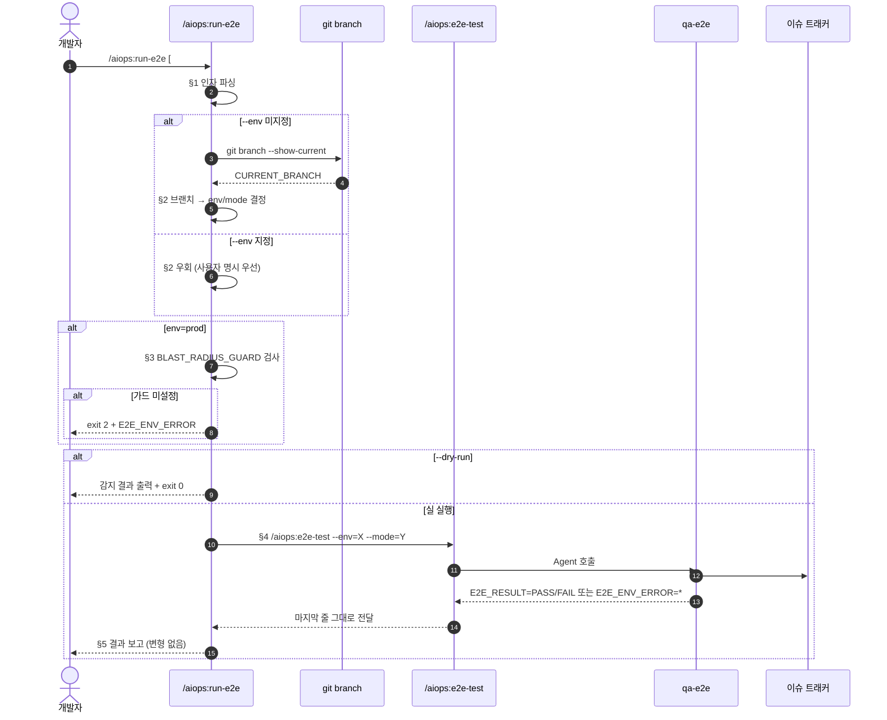

E2E 테스트를 **현재 브랜치 컨텍스트 기준으로 자동 환경 선택**하여 실행합니다.

> **#131 신규 스킬**: `/aiops:e2e-test` 는 `--env=`/`--mode=` 를 명시해야 하는 저수준 진입점입니다. `/aiops:run-e2e` 는 사용자가 인자 없이 호출해도 "지금 어디서 실행해야 하는지" 를 브랜치/머지 상태로부터 판정하여 적절한 `/aiops:e2e-test` 호출로 위임하는 **사용자 친화 래퍼** 입니다.

> **비교**:
> - `/aiops:e2e-test --env=X --mode=Y` — 명시적 매개변수 호출 진입점 (저수준)
> - `/aiops:run-e2e` (본 스킬) — 자동 환경 선택 + `/aiops:e2e-test` 위임 (고수준)
> - `/aiops:verify-deploy --env=X` — 배포 검증 통합 (Actions 대기 + 헬스체크 + E2E)

---

## 1. 인자 파싱

`$ARGUMENTS` 에서 다음을 추출합니다.

| 인자 | 패턴 | 기본값 | 비고 |
|------|------|--------|------|
| `--env=<value>` | `local` \| `dev` \| `prod` | (자동 감지) | **명시 시 자동 감지 우회** |
| `--mode=<value>` | `full` \| `smoke` | 환경별 기본값 | local/dev → `full`, prod → `smoke` |
| `--issue=<N>` 또는 `#N` | 정수 | (없음) | 결과 댓글 등록 대상 이슈 |
| `--dry-run` | flag | `false` | 환경 감지 결과만 출력하고 종료 |

### 1.1 파싱 의사 코드

```bash
ARG_ENV=$(grep -oE -- '--env=[a-z]+'   <<<"$ARGUMENTS" | head -1 | cut -d= -f2)
ARG_MODE=$(grep -oE -- '--mode=[a-z]+' <<<"$ARGUMENTS" | head -1 | cut -d= -f2)
ARG_ISSUE=$(grep -oE -- '--issue=[0-9]+' <<<"$ARGUMENTS" | head -1 | cut -d= -f2)
[[ -z "$ARG_ISSUE" ]] && ARG_ISSUE=$(grep -oE '#[0-9]+' <<<"$ARGUMENTS" | head -1 | tr -d '#')
ARG_DRY=$(grep -qE -- '--dry-run' <<<"$ARGUMENTS" && echo true || echo false)
```

### 1.2 값 검증

- `ARG_ENV` 가 비어있지 않은데 `{local, dev, prod}` 외 값 → 종료 코드 2 + `E2E_ENV_ERROR=invalid_env:<v>`
- `ARG_MODE` 가 비어있지 않은데 `{full, smoke}` 외 값 → 종료 코드 2 + `E2E_ENV_ERROR=invalid_mode:<v>`

---

## 2. 환경 자동 감지 (인자 `--env` 미지정 시)

`--env` 가 명시되지 않은 경우에만 본 절을 수행합니다. 명시되어 있으면 본 절을 건너뛰고 §4 로 진입합니다.

### 2.1 브랜치 판정 알고리즘

```bash
if [[ -z "$ARG_ENV" ]]; then
  CURRENT_BRANCH=$(git branch --show-current 2>/dev/null)

  case "$CURRENT_BRANCH" in
    main)
      DETECTED_ENV=prod
      DETECTED_MODE_DEFAULT=smoke   # prod 안전 기본값
      ;;
    dev)
      DETECTED_ENV=dev
      DETECTED_MODE_DEFAULT=full
      ;;
    feature/issue-*|issue-*|feature/*)
      DETECTED_ENV=local
      DETECTED_MODE_DEFAULT=full
      ;;
    *)
      # 기타 브랜치 — 안전 기본값 local
      DETECTED_ENV=local
      DETECTED_MODE_DEFAULT=full
      ;;
  esac
else
  DETECTED_ENV="$ARG_ENV"
  case "$DETECTED_ENV" in
    prod) DETECTED_MODE_DEFAULT=smoke ;;
    *)    DETECTED_MODE_DEFAULT=full ;;
  esac
fi

FINAL_ENV="$DETECTED_ENV"
FINAL_MODE="${ARG_MODE:-$DETECTED_MODE_DEFAULT}"
```

### 2.2 감지 결과 매트릭스

| 현재 브랜치 | 감지된 ENV | 기본 MODE | 비고 |
|-------------|-----------|-----------|------|
| `main` | `prod` | `smoke` | **prod 안전 모드** (BLAST_RADIUS_GUARD 의무) |
| `dev` | `dev` | `full` | dev 풀 회귀 |
| `feature/issue-*` | `local` | `full` | 개발 브랜치 — 로컬 풀 |
| `feature/*` 외 | `local` | `full` | 기타 작업 브랜치 — 로컬 풀 |
| (브랜치 미감지) | `local` | `full` | 안전 폴백 |

> 본 감지 로직은 본 저장소의 브랜치 전략 (`feature/issue-N` → `dev` → `main`) 을 전제로 합니다. 다른 브랜치 모델을 사용하는 프로젝트에서는 `--env=` 명시 호출을 권장합니다.

> **`platform=cli` 프로젝트 안내 (#41)**: 대상 프로젝트가 `agent_hints.platform=cli` (CLI 전용, 배포 대상 없음) 인 경우, 위 감지 결과가 `dev`/`prod` 여도 위임 대상인 `/aiops:e2e-test` 가 **local 로 자동 강등**하고 `aiops:qa-e2e-cli` 로 라우팅합니다 (§4 위임 시 그대로 전달, 강등은 `/aiops:e2e-test` §1.5 에서 수행). 본 스킬 자체의 브랜치 감지 로직은 변경되지 않습니다.

---

## 3. prod 안전 검사 (BLAST_RADIUS_GUARD)

`FINAL_ENV=prod` 인 경우 `BLAST_RADIUS_GUARD` 환경변수 의무 검사를 수행합니다.

```bash
if [[ "$FINAL_ENV" == "prod" ]]; then
  if [[ -z "${BLAST_RADIUS_GUARD:-}" ]]; then
    echo "[run-e2e] ⚠️ prod 환경 실행 거부 — BLAST_RADIUS_GUARD 미설정"
    echo ""
    echo "의도적 prod E2E 실행이라면 다음과 같이 호출:"
    echo "  BLAST_RADIUS_GUARD=1 /aiops:run-e2e"
    echo ""
    echo "또는 dev 환경에서 먼저 검증:"
    echo "  /aiops:run-e2e --env=dev --mode=full"
    echo ""
    echo "E2E_ENV_ERROR=blast_radius_guard_required"
    exit 2
  fi
fi
```

> 가드는 `aiops:qa-e2e` 의 G4 게이트와 이중 검사됩니다 — 본 스킬은 사용자 친화 안내, `aiops:qa-e2e` 는 최종 거부.

---

## 4. /aiops:e2e-test 위임

결정된 `FINAL_ENV`, `FINAL_MODE`, `ARG_ISSUE`, `ARG_DRY` 를 그대로 `/aiops:e2e-test` 에 전달합니다.

### 4.1 위임 명령 조립

```bash
DELEGATE_ARGS="--env=$FINAL_ENV --mode=$FINAL_MODE"
[[ -n "$ARG_ISSUE" ]] && DELEGATE_ARGS="$DELEGATE_ARGS #$ARG_ISSUE"
[[ "$ARG_DRY" == "true" ]] && DELEGATE_ARGS="$DELEGATE_ARGS --dry-run"

echo "[run-e2e] 환경 감지: 브랜치=$CURRENT_BRANCH → env=$FINAL_ENV, mode=$FINAL_MODE"
echo "[run-e2e] 위임 → /aiops:e2e-test $DELEGATE_ARGS"
```

### 4.2 dry-run 분기

`--dry-run` 인 경우 감지 결과만 출력하고 즉시 종료합니다 (qa-e2e 호출 없음).

```bash
# >>> run-e2e:dry-run >>>
if [[ "$ARG_DRY" == "true" ]]; then
  cat <<EOF
[run-e2e] dry-run 결과
- 현재 브랜치: ${CURRENT_BRANCH:-(미감지)}
- 감지된 환경: $FINAL_ENV
- 모드: $FINAL_MODE
- 이슈 번호: ${ARG_ISSUE:-(없음)}
- 위임 명령: /aiops:e2e-test $DELEGATE_ARGS
EOF
  echo "E2E_RESULT=DRY_RUN"
  exit 0
fi
# <<< run-e2e:dry-run <<<
```

`E2E_RESULT=DRY_RUN` 은 게이트 통과 신호가 아닙니다 — 감지 결과만 출력했을 뿐 `/aiops:e2e-test` 를 호출하지 않았습니다.

### 4.3 실 호출

`/aiops:e2e-test` 스킬을 위 인자로 호출합니다. (Claude Code 환경에서는 슬래시 커맨드 호출, 외부 스크립트에서는 동일 매개변수로 `aiops:qa-e2e` Agent 호출.)

```bash
# 슬래시 커맨드 호출 (Claude Code 환경)
/aiops:e2e-test $DELEGATE_ARGS
```

---

## 5. 결과 보고 (qa-e2e 출력 그대로 전달)

`/aiops:e2e-test` (→ `aiops:qa-e2e`) 가 등록한 결과 헤더와 마지막 줄 (`E2E_RESULT=...` / `E2E_ENV_ERROR=...`) 을 **변형 없이** 그대로 전달합니다.

| 위임 결과 마지막 줄 | run-e2e 종료 코드 |
|--------------------|:----------------:|
| `E2E_RESULT=DRY_RUN` | 0 |
| `E2E_RESULT=PASS` | 0 |
| `E2E_RESULT=FAIL` | 1 |
| `E2E_ENV_ERROR=*` | 2 |

본 스킬은 결과 헤더(`## 🌐 ... E2E 결과 — ...`) 를 자체적으로 등록하지 않습니다 — 모두 `aiops:qa-e2e` 가 등록합니다 (단일 출처 원칙).

---

## 6. 시퀀스 다이어그램



---

## 7. 사용 예시

### 7.1 브랜치별 자동 감지 호출

```bash
# 현재 브랜치: feature/issue-131
/aiops:run-e2e
# → /aiops:e2e-test --env=local --mode=full

# 현재 브랜치: dev
/aiops:run-e2e --issue=131
# → /aiops:e2e-test --env=dev --mode=full #131

# 현재 브랜치: main
BLAST_RADIUS_GUARD=1 /aiops:run-e2e
# → /aiops:e2e-test --env=prod --mode=smoke (BLAST_RADIUS_GUARD 주입)
```

### 7.2 자동 감지 우회 (사용자 명시)

```bash
# feature 브랜치에서 dev 환경 강제 실행
/aiops:run-e2e --env=dev --mode=smoke

# dev 브랜치에서 local 빠른 점검
/aiops:run-e2e --env=local --mode=smoke
```

### 7.3 dry-run 으로 감지만 확인

```bash
/aiops:run-e2e --dry-run
# 출력 예시:
# [run-e2e] dry-run 결과
# - 현재 브랜치: feature/issue-131
# - 감지된 환경: local
# - 모드: full
# - 위임 명령: /aiops:e2e-test --env=local --mode=full
# E2E_RESULT=DRY_RUN
```

### 7.4 후속 자동화와의 관계

| 호출 시점 | 권장 진입점 | 비고 |
|----------|------------|------|
| 사용자 수동 (브랜치 기반) | `/aiops:run-e2e [#N]` | 본 스킬 — 자동 감지 |
| 사용자 수동 (명시 매개변수) | `/aiops:e2e-test --env=X --mode=Y #N` | 저수준 |
| 배포 검증 (Actions + 헬스체크 포함) | `/aiops:verify-deploy --env=X --issue=N` | 통합 검증 |
| devflow STEP 8 (config 토글 시) | `/aiops:e2e-test --env=local --mode=full #N` | 자동화 |
| `/aiops:merge-pr` (opt-in 시) | `/aiops:e2e-test --env=dev --mode=full #N` | 자동화 |
| `/aiops:deploy-prod` | `/aiops:e2e-test --env=prod --mode=smoke #N` | 자동화 (BLAST_RADIUS_GUARD 주입) |

---

## 8. 현재 제공된 인자

$ARGUMENTS

위 절차 (1 → 2 → 3 → 4 → 5) 순서로 진행해줘.
