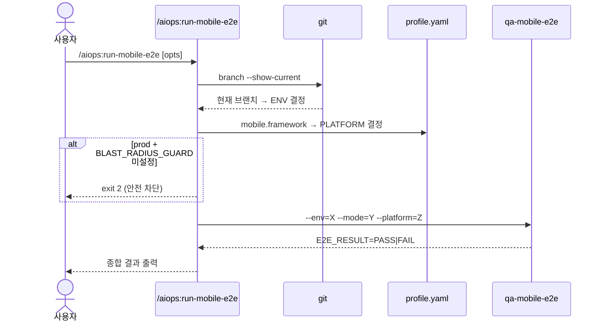

# /aiops:run-mobile-e2e

웹의 `/aiops:run-e2e`에 해당하는 모바일판. 현재 컨텍스트(브랜치 + profile.yaml)를 보고 환경/플랫폼을 자동 결정.

## 1. 인자 파싱

| 인자 | 값 | 기본값 |
|------|-----|------|
| `--env=<v>` | `local|dev|prod` | 브랜치 기반 자동 |
| `--mode=<v>` | `full|smoke` | env=prod → smoke / 그 외 → full |
| `--platform=<v>` | `android|ios|all` | profile.yaml 기준 자동 |
| `#<N>` | 이슈 번호 | (선택) |
| `--dry-run` | flag | false |

```bash
ARG_ENV=$(grep -oE -- '--env=[a-z]+' <<<"$ARGUMENTS" | head -1 | cut -d= -f2)
ARG_MODE=$(grep -oE -- '--mode=[a-z]+' <<<"$ARGUMENTS" | head -1 | cut -d= -f2)
ARG_PLATFORM=$(grep -oE -- '--platform=[a-z]+' <<<"$ARGUMENTS" | head -1 | cut -d= -f2)
ARG_ISSUE=$(grep -oE '#?[0-9]+' <<<"$ARGUMENTS" | head -1 | tr -d '#')
ARG_DRY=$(grep -qE -- '--dry-run' <<<"$ARGUMENTS" && echo true || echo false)
```

## 2. 환경 자동 감지

### 2.1 env 결정 (--env 미지정 시)

```bash
if [[ -z "$ARG_ENV" ]]; then
  CURRENT_BRANCH=$(git branch --show-current)
  case "$CURRENT_BRANCH" in
    feature/*|issue-*) ENV="local" ;;
    dev)               ENV="dev" ;;
    main)              ENV="prod" ;;
    *)                 ENV="local" ;;
  esac
else
  ENV="$ARG_ENV"
fi
```

### 2.2 mode 결정

```bash
if [[ -z "$ARG_MODE" ]]; then
  case "$ENV" in
    prod) MODE="smoke" ;;
    *)    MODE="full" ;;
  esac
else
  MODE="$ARG_MODE"
fi
```

### 2.3 platform 결정 (--platform 미지정 시)

```bash
if [[ -z "$ARG_PLATFORM" ]]; then
  # profile.yaml 의 mobile.framework 에서 결정
  FW=$(grep -A5 '^mobile:' .reviewer/profile.yaml 2>/dev/null | grep 'framework:' | awk '{print $2}')

  case "$FW" in
    android-native) PLATFORM="android" ;;
    ios-native)     PLATFORM="ios" ;;
    react-native|flutter) PLATFORM="all" ;;  # 크로스 플랫폼은 양쪽
    *)              PLATFORM="android" ;;     # 폴백
  esac
else
  PLATFORM="$ARG_PLATFORM"
fi
```

## 3. prod 안전 검사

```bash
if [[ "$ENV" == "prod" && -z "${BLAST_RADIUS_GUARD:-}" ]]; then
  echo "ERROR: prod 환경에서는 BLAST_RADIUS_GUARD=1 환경변수 필수"
  echo "  실행: BLAST_RADIUS_GUARD=1 /aiops:run-mobile-e2e --env=prod"
  exit 2
fi
```

## 4. qa-mobile-e2e 위임

### 단일 플랫폼

```
Agent("qa-mobile-e2e", "--env=$ENV --mode=$MODE --platform=$PLATFORM --issue=$ARG_ISSUE")
```

### 양쪽 플랫폼 (--platform=all)

순차 실행 (병렬 시 에뮬레이터 충돌):

```bash
for p in android ios; do
  Agent("qa-mobile-e2e", "--env=$ENV --mode=$MODE --platform=$p --issue=$ARG_ISSUE")
done
```

종합 Sign-off: 둘 다 PASS → 통합 PASS.

## 5. 종합 결과 출력

```markdown
## 📱 /aiops:run-mobile-e2e 종합 결과

- 환경: dev (자동: 브랜치 dev)
- 모드: full
- 플랫폼: android + ios

| 플랫폼 | 결과 | 헤더 |
|--------|:----:|------|
| android | ✅ PASS | ## 📱 Mobile E2E 결과 — android/full |
| ios | ✅ PASS | ## 📱 Mobile E2E 결과 — ios/full |

종합 판정: ✅ PASS
```

## 6. 사용 예시

```bash
# 자동 감지 (브랜치 + profile)
/aiops:run-mobile-e2e #N

# 명시
/aiops:run-mobile-e2e --env=dev --mode=smoke --platform=android #N

# 양쪽 플랫폼
/aiops:run-mobile-e2e --platform=all #N

# prod (반드시 BLAST_RADIUS_GUARD)
BLAST_RADIUS_GUARD=1 /aiops:run-mobile-e2e --env=prod #N

# dry-run
/aiops:run-mobile-e2e --dry-run #N
```

## 7. /aiops:run-e2e 와의 관계

| 스킬 | 대상 |
|------|------|
| `/aiops:run-e2e` | 웹 — Playwright |
| `/aiops:run-mobile-e2e` | 모바일 — Maestro |
| `/aiops:verify-deploy` | 배포 검증 통합 (web + mobile 통합 가능) |

## 8. 의존 정보

- 인터페이스: #146 (mobile.framework, mobile.e2e_runner=maestro)
- 위임 에이전트: qa-mobile-e2e (#150 본 이슈에서 작성)
- 호출자: mobileflow STEP 8 (#151), 사용자 직접

## 9. 시퀀스 다이어그램



---

현재 제공된 인자: $ARGUMENTS

위 절차대로 진행해줘.
