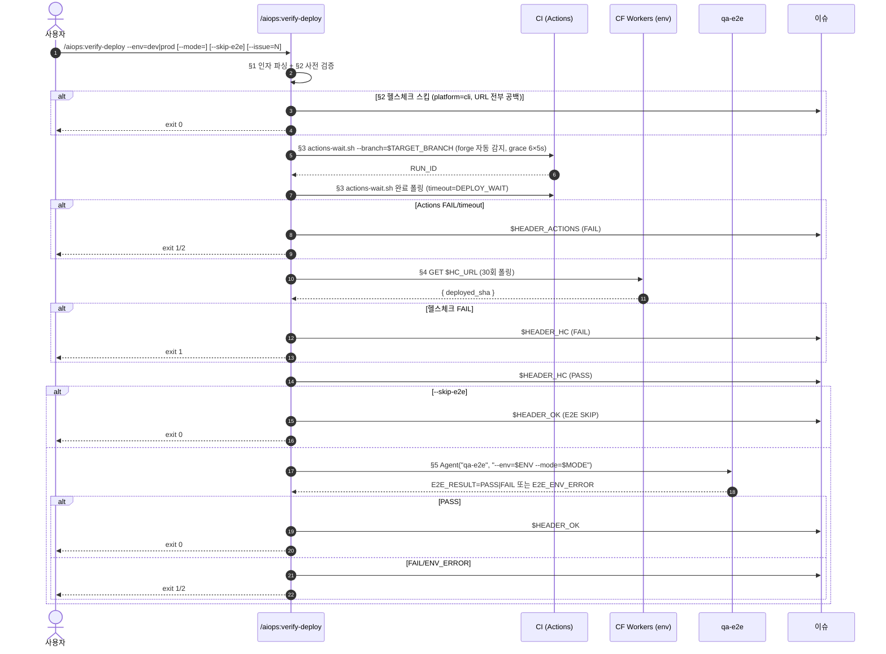

배포 검증을 통합 실행합니다 — Actions 대기 + 헬스체크 + E2E.

> **#131 신규 스킬**: 기존에는 `/aiops:merge-pr` 가 자동으로 §11~§14 (Actions 대기 + 헬스체크 + dev E2E) 를 수행했지만, dev E2E 가 기본 SKIP 으로 반전(#131)되면서, "배포 검증" 흐름을 별도 스킬로 분리해 운영 중 임의 시점에 호출할 수 있게 합니다.

> **호환성**: 본 스킬은 `/aiops:merge-pr` §11~§14 와 동일한 알고리즘/마커를 사용합니다. `/aiops:merge-pr` 내부에서 §11~§14 를 호출하던 흐름은 그대로 유지되며, 본 스킬은 **단독 호출 진입점**을 추가합니다.

---

## 1. 인자 파싱

`$ARGUMENTS` 에서 다음을 추출:

- **`--env=dev|prod`** (필수): 검증 대상 환경. 미지정 시 에러.
- **`--mode=full|smoke`** (선택): E2E 실행 모드. 기본값은 `--env=dev` 시 `full`, `--env=prod` 시 `smoke`.
- **`--skip-e2e`** (선택): E2E 실행을 건너뜀. Actions 대기 + 헬스체크만 수행.
- **`--issue=<N>`** (선택): 결과 마커 댓글을 등록할 이슈 번호. 미지정 시 stdout 출력만 수행 (이슈 댓글 없음).

```bash
# §1.1 인자 파싱
ENV=""
MODE=""
SKIP_E2E=false
ISSUE=""

for arg in $ARGUMENTS; do
  case "$arg" in
    --env=*)    ENV="${arg#--env=}" ;;
    --mode=*)   MODE="${arg#--mode=}" ;;
    --skip-e2e) SKIP_E2E=true ;;
    --issue=*)  ISSUE="${arg#--issue=}" ;;
    *)          echo "[verify-deploy] WARN: 알 수 없는 인자: $arg" ;;
  esac
done

# §1.2 env 검증
if [[ -z "$ENV" ]]; then
  echo "ERROR: --env=dev|prod 필수. 예: /aiops:verify-deploy --env=dev --issue=131"
  exit 1
fi

if [[ "$ENV" != "dev" && "$ENV" != "prod" ]]; then
  echo "ERROR: --env 는 dev 또는 prod 만 허용 (입력: $ENV)"
  exit 1
fi

# §1.3 mode 기본값 (env 별)
if [[ -z "$MODE" ]]; then
  if [[ "$ENV" == "prod" ]]; then
    MODE="smoke"  # prod 는 기본 smoke (BLAST_RADIUS_GUARD)
  else
    MODE="full"   # dev 는 기본 full
  fi
fi

if [[ "$MODE" != "full" && "$MODE" != "smoke" ]]; then
  echo "ERROR: --mode 는 full 또는 smoke 만 허용 (입력: $MODE)"
  exit 1
fi

echo "[verify-deploy] §1 인자: env=$ENV mode=$MODE skip_e2e=$SKIP_E2E issue=${ISSUE:-N/A}"
```

---

## 2. 사전 검증 + 환경별 변수 설정

### 2.1 e2e_test_enabled 검사

```bash
E2E_ENABLED=$(jq -r '.e2e_test_enabled // false' .claude/config.json 2>/dev/null || echo false)
if [[ "$E2E_ENABLED" != "true" && "$SKIP_E2E" != "true" ]]; then
  echo "[verify-deploy] §2.1 ⚠️ e2e_test_enabled=false — E2E 흐름을 자동으로 --skip-e2e 처리"
  SKIP_E2E=true
fi
```

### 2.2 환경별 변수 (URL / 브랜치 / config 키)

```bash
# §2.2 환경 별 분기
if [[ "$ENV" == "dev" ]]; then
  TARGET_BRANCH="dev"
  URL_BASE_KEY="cf_dev_url"
  URL_RAW_KEY="e2e_dev_url"
  HEADER_OK="## 🌐 Dev 배포 검증 — 통과"
  HEADER_HC="## 🩺 dev 헬스체크"
  HEADER_ACTIONS="## 🔁 dev 배포 대기 결과"
  HEADER_E2E="## 🌐 Dev E2E 결과 — $MODE"
  WORKFLOW_KEYS="deploy_workflow github_actions_workflow"        # ← 종전 체인 그대로(M-3/M-2 dev 불변)
  WORKFLOW_KEY_HINT="\`deploy_workflow\`"
else
  TARGET_BRANCH="main"
  URL_BASE_KEY="cf_prod_url"
  URL_RAW_KEY="e2e_prod_url"
  HEADER_OK="## 🚦 prod 배포 검증 — 통과"
  HEADER_HC="## 🩺 prod 헬스체크"
  HEADER_ACTIONS="## 🚦 prod Actions 결과"
  HEADER_E2E="## 🌐 prod smoke E2E 결과"
  WORKFLOW_KEYS="deploy_workflow_prod deploy_workflow github_actions_workflow"   # ← ★신규 1단
  WORKFLOW_KEY_HINT="\`deploy_workflow_prod\`(권장) 또는 \`deploy_workflow\`"
fi

# §2.3 config 로드
# >>> workflow-resolve:env >>>
# §2.2 가 세팅한 WORKFLOW_KEYS 를 순회. env 재분기 금지(D-3).
WORKFLOW=""; WORKFLOW_SOURCE="default"
for _k in $WORKFLOW_KEYS; do
  _v=$(jq -r --arg k "$_k" '.[$k] // empty' .claude/config.json 2>/dev/null || echo "")
  if [[ -n "$_v" ]]; then WORKFLOW="$_v"; WORKFLOW_SOURCE="$_k"; break; fi
done
[[ -z "$WORKFLOW" ]] && WORKFLOW="deploy-cf.yml"
# <<< workflow-resolve:env <<<

DEPLOY_WAIT=$(jq -r '.e2e_deploy_wait_sec // 120' .claude/config.json)
HC_PATH=$(jq -r '.e2e_healthcheck_path // "/health"' .claude/config.json)
URL_BASE=$(jq -r ".$URL_BASE_KEY // \"\"" .claude/config.json)
URL_RAW=$(jq -r ".$URL_RAW_KEY // .$URL_BASE_KEY // \"\"" .claude/config.json)
TARGET_URL="${URL_RAW//\$\{$URL_BASE_KEY\}/$URL_BASE}"

# §2.3b 스킵 판정 (#42)
HC_URL_ASSEMBLED="$TARGET_URL"
# >>> verify-deploy:healthcheck-gate >>>
# 선행 변수(앵커 밖): HC_URL_ASSEMBLED — 치환 완료된 헬스체크 base URL (빈 문자열 허용)
# 산출 변수(앵커 밖에서 소비): HC_SKIP("true"|"false") · HC_SKIP_REASON · HC_PLATFORM
# 판정: platform=cli AND URL 전부 빈 값 → SKIP. 그 외 전부 CHECK(종전 동작).
HC_URL_ASSEMBLED="${HC_URL_ASSEMBLED:-}"
HC_PLATFORM=$(jq -r '.agent_hints.platform // ""' .claude/config.json 2>/dev/null || echo "")
if [[ -z "$HC_PLATFORM" && -f .reviewer/profile.yaml ]]; then
  HC_PLATFORM=$(grep -E '^[[:space:]]*platform:[[:space:]]*' .reviewer/profile.yaml 2>/dev/null \
    | head -1 | sed -E 's/^[[:space:]]*platform:[[:space:]]*"?([A-Za-z]+)"?.*$/\1/')
fi
HC_PLATFORM="${HC_PLATFORM:-}"
HC_SKIP=false
HC_SKIP_REASON=""
if [[ -z "${HC_URL_ASSEMBLED//[[:space:]]/}" && "$HC_PLATFORM" == "cli" ]]; then
  HC_SKIP=true
  HC_SKIP_REASON="platform_cli"
fi
# <<< verify-deploy:healthcheck-gate <<<

if [[ "$HC_SKIP" == "true" ]]; then
  if [[ "$ENV" == "dev" ]]; then
    HC_URL_KEY_HINT="dev_url / cf_dev_url / e2e_dev_url"
  else
    HC_URL_KEY_HINT="prod_url / cf_prod_url / e2e_prod_url"
  fi
  if [[ -n "$ISSUE" ]]; then
    bash "${CLAUDE_PLUGIN_ROOT}/scripts/forge.sh" issue-comment "$ISSUE" "## ℹ️ 헬스체크 스킵

healthcheck_skipped=platform_cli

- 환경: $ENV
- 스킬: /aiops:verify-deploy §2
- 사유: platform=cli 이며 $HC_URL_KEY_HINT 이 모두 비어 있음 — 헬스체크 대상 없음
- 판정 근거: agent_hints.platform (.claude/config.json) → .reviewer/profile.yaml
- 건너뛴 단계: Actions 대기(§3) · 헬스체크(§4) · E2E(§5)
- Actions 대기: 스킵 — 배포 대상이 없어 workflow_run 검증을 수행하지 않음 (배포 워크플로가 설정된 CLI 레포라도 이 검증은 생략됩니다)
- 헬스체크: 스킵 — $HC_URL_KEY_HINT 이 모두 비어 있어 조회할 엔드포인트 없음
- E2E: 스킵 — 대상 URL 없음 (--skip-e2e 여부와 무관하며 §6 결과 마커는 등록되지 않습니다)
- 다음 액션: 없음 (정상 종료, exit 0). 배포 대상이 생기면 \`.claude/config.json\` 의 해당 URL 키를 설정하면 자동으로 검사 모드로 전환됩니다"
  fi
  echo "[verify-deploy] §2 헬스체크 스킵 (env=$ENV, 사유=$HC_SKIP_REASON) — §3 Actions 대기·§4 헬스체크·§5 E2E 모두 건너뛰고 정상 종료"
  exit 0
elif [[ -z "$TARGET_URL" ]]; then
  echo "[verify-deploy] §2 ERROR: $URL_RAW_KEY / $URL_BASE_KEY 모두 비어있어 헬스체크 URL 조립 불가"
  [[ -n "$ISSUE" ]] && bash "${CLAUDE_PLUGIN_ROOT}/scripts/forge.sh" issue-comment "$ISSUE" "## ⚠️ ${ENV^} 배포 검증 환경 오류

E2E_ENV_ERROR=empty_target_url

- 다음 액션: \`.claude/config.json\` 의 \`$URL_BASE_KEY\` 또는 \`$URL_RAW_KEY\` 설정"
  exit 2
fi

echo "[verify-deploy] §2 검증 대상: $TARGET_URL (브랜치=$TARGET_BRANCH, workflow=$WORKFLOW, source=$WORKFLOW_SOURCE)"
```

---

## 3. CI/CD Actions workflow_run 대기 (GitHub/Gitea forge 자동 감지)

`/aiops:merge-pr §12` 의 알고리즘을 재사용하되, 브랜치만 환경별로 분기합니다.

```bash
# §3.1~3.3 workflow run 대기 — forge 자동 감지 헬퍼 (GitHub=gh CLI / Gitea=REST API)
#   출력 계약: 마지막 stdout 줄 "RUN_ID=<id> RUN_URL=<url> CONCLUSION=<...>"
#   종료 코드: 0=success / 1=failure·cancelled / 124=timeout / 2=run 미발견
WAIT_LINE=$("${CLAUDE_PLUGIN_ROOT}/scripts/actions-wait.sh" \
  --branch "$TARGET_BRANCH" --workflow "$WORKFLOW" --timeout "$DEPLOY_WAIT")
WORKFLOW_EXIT=$?
RUN_ID=$(sed -E 's/.*RUN_ID=([^ ]*).*/\1/' <<<"$WAIT_LINE")
RUN_URL=$(sed -E 's/.*RUN_URL=([^ ]*).*/\1/' <<<"$WAIT_LINE")

# §3.2 run 미발견 → 환경 오류
if [[ $WORKFLOW_EXIT -eq 2 ]]; then
  [[ -n "$ISSUE" ]] && bash "${CLAUDE_PLUGIN_ROOT}/scripts/forge.sh" issue-comment "$ISSUE" "$HEADER_ACTIONS

E2E_ENV_ERROR=workflow_run_not_found:$WORKFLOW@$TARGET_BRANCH

- 워크플로우 \`$WORKFLOW\` 의 head_branch=$TARGET_BRANCH run 을 30초 내 찾지 못함
- 적용된 키: \`$WORKFLOW_SOURCE\`
- 다음 액션: \`.claude/config.json\` 의 $WORKFLOW_KEY_HINT 또는 \`.gitea/workflows/$WORKFLOW\`(Gitea) · \`.github/workflows/$WORKFLOW\`(GitHub) 확인"
  exit 2
fi

if [[ $WORKFLOW_EXIT -ne 0 ]]; then
  if [[ $WORKFLOW_EXIT -eq 124 ]]; then
    REASON="timeout(${DEPLOY_WAIT}s)"
  else
    REASON="workflow_failed"
  fi
  [[ -n "$ISSUE" ]] && bash "${CLAUDE_PLUGIN_ROOT}/scripts/forge.sh" issue-comment "$ISSUE" "$HEADER_ACTIONS

- 사유: $REASON
- 워크플로우: \`$WORKFLOW\` (branch=$TARGET_BRANCH)
- run_id: $RUN_ID
- run_url: $RUN_URL
- 다음 액션: run_url 로그 확인 후 재시도 (CI 웹 UI 에서 re-run)"
  exit 1
fi

echo "[verify-deploy] §3 Actions 통과 (run_id=$RUN_ID)"
```

---

## 4. 헬스체크 (deployed_sha 매칭)

`/aiops:merge-pr §13` 의 알고리즘을 재사용하되, URL/브랜치만 환경별로 분기합니다.

```bash
# §4.1 기대 SHA = origin/$TARGET_BRANCH 의 최신 SHA
git fetch origin "$TARGET_BRANCH" --quiet 2>/dev/null || true
EXPECTED_SHA=$(git rev-parse "origin/$TARGET_BRANCH")
EXPECTED_SHORT=${EXPECTED_SHA:0:7}

# §4.2 폴링 (최대 30회 × 5초 = 150초)
HC_PASS=false
DEPLOYED_SHA=""
HC_URL="${TARGET_URL%/}${HC_PATH}"
for i in $(seq 1 30); do
  RESP=$(curl -s -m 5 "$HC_URL" 2>/dev/null || echo "")
  DEPLOYED_SHA=$(echo "$RESP" | jq -r '.deployed_sha // ""' 2>/dev/null)

  if [[ -n "$DEPLOYED_SHA" ]]; then
    if [[ "$DEPLOYED_SHA" == "$EXPECTED_SHA" ]] \
      || [[ "$DEPLOYED_SHA" == "$EXPECTED_SHORT" ]] \
      || [[ "$EXPECTED_SHA" == "$DEPLOYED_SHA"* ]]; then
      HC_PASS=true
      break
    fi
  fi
  sleep 5
done

# §4.3 헬스체크 결과 마커
if [[ "$HC_PASS" != "true" ]]; then
  [[ -n "$ISSUE" ]] && bash "${CLAUDE_PLUGIN_ROOT}/scripts/forge.sh" issue-comment "$ISSUE" "$HEADER_HC

- 결과: ❌ 타임아웃(150s)
- URL: $HC_URL
- 기대 SHA: $EXPECTED_SHORT
- 응답 SHA: ${DEPLOYED_SHA:-none}
- 다음 액션: \`/health\` 응답에 \`deployed_sha\` 포함 여부 확인 + CF 워커 배포 로그 확인"
  exit 1
fi

[[ -n "$ISSUE" ]] && bash "${CLAUDE_PLUGIN_ROOT}/scripts/forge.sh" issue-comment "$ISSUE" "$HEADER_HC

- 결과: ✅ PASS
- URL: $HC_URL
- 기대 SHA: $EXPECTED_SHORT
- 응답 SHA: $DEPLOYED_SHA"

echo "[verify-deploy] §4 헬스체크 통과 (SHA=$EXPECTED_SHORT)"
```

---

## 5. E2E 실행 (`--skip-e2e` 아닐 때)

`--skip-e2e` 인자가 있으면 본 절을 건너뛰고 §6 으로 진행합니다.

> **`platform=cli` 안내 (#41)**: `platform=cli` 프로젝트의 E2E 는 배포 대상이 없어 본 스킬(배포 검증 통합)에서 수행하지 않는다. devflow STEP 8 또는 `/aiops:e2e-test --env=local`(→ `aiops:qa-e2e-cli` 라우팅)에서 수행한다. 아래 §2 헬스체크 스킵(`platform_cli`)과 정합되는 동작이며, 본 절의 호출 방식·코드는 변경되지 않는다.

```bash
if [[ "$SKIP_E2E" == "true" ]]; then
  echo "[verify-deploy] §5 SKIP — --skip-e2e (또는 e2e_test_enabled=false)"
  E2E_LAST_LINE="E2E_SKIPPED"
  E2E_EXIT=0
else
  # §5.1 qa-e2e 호출 (Agent 도구 권장)
  #   Agent("qa-e2e", "--env=$ENV --mode=$MODE --issue=$ISSUE")
  #
  # 헤드리스 환경에서는 다음 동등 셸 호출 사용:
  E2E_OUTPUT_FILE=$(mktemp)
  E2E_EXIT=0
  {
    ./run-qa-e2e.sh --env="$ENV" --mode="$MODE" --issue="${ISSUE:-0}" 2>&1
  } | tee "$E2E_OUTPUT_FILE"
  E2E_EXIT=${PIPESTATUS[0]}
  E2E_LAST_LINE=$(tail -n 1 "$E2E_OUTPUT_FILE" | tr -d '\r\n')

  echo "[verify-deploy] §5 qa-e2e 종료: exit=$E2E_EXIT last_line=$E2E_LAST_LINE"
fi
```

---

## 6. 결과 마커 (4종 시나리오)

종료 코드와 마지막 줄을 동시에 검사하여 시나리오 A/B/C/E (SKIP) 로 분기합니다.

| 시나리오 | 조건 | 등록 헤더 | 종료 코드 |
| --- | --- | --- | --- |
| **A. 정상 PASS** | exit=0 + `E2E_RESULT=PASS` | `$HEADER_E2E` (qa-e2e 가 이미 등록) + `$HEADER_OK` (verify-deploy 추가) | 0 |
| **B. E2E FAIL** | exit=1 + `E2E_RESULT=FAIL` | `## ❌ ${ENV^} E2E FAIL` + `E2E_RESULT=FAIL` | 1 |
| **C. 환경 오류** | exit=2 + `E2E_ENV_ERROR=*` | `## ⚠️ ${ENV^} E2E 환경 오류` + `E2E_ENV_ERROR=<reason>` | 2 |
| **E. SKIP** | `--skip-e2e` 또는 e2e 비활성 | `$HEADER_OK` (배포 검증만 PASS) | 0 |

```bash
case "$E2E_EXIT:$E2E_LAST_LINE" in
  0:E2E_SKIPPED)
    # 시나리오 E — E2E 건너뜀, 배포 검증만 PASS
    [[ -n "$ISSUE" ]] && bash "${CLAUDE_PLUGIN_ROOT}/scripts/forge.sh" issue-comment "$ISSUE" "$HEADER_OK

- env: $ENV
- target_url: $TARGET_URL
- deployed_sha: $DEPLOYED_SHA
- E2E: SKIPPED (--skip-e2e 또는 e2e_test_enabled=false)
- 다음 액션: 필요 시 \`/aiops:e2e-test --env=$ENV --mode=$MODE\` 수동 실행"
    echo "[verify-deploy] §6 시나리오 E — 배포 검증 PASS (E2E SKIP)"
    exit 0
    ;;

  0:E2E_RESULT=PASS)
    # 시나리오 A — qa-e2e 가 이미 `$HEADER_E2E` 댓글을 등록
    [[ -n "$ISSUE" ]] && bash "${CLAUDE_PLUGIN_ROOT}/scripts/forge.sh" issue-comment "$ISSUE" "$HEADER_OK

- env: $ENV
- target_url: $TARGET_URL
- deployed_sha: $DEPLOYED_SHA
- E2E: $MODE PASS (\`$HEADER_E2E\` 댓글 참조)"
    echo "[verify-deploy] §6 시나리오 A — $ENV 배포 검증 + E2E PASS"
    exit 0
    ;;

  1:E2E_RESULT=FAIL)
    # 시나리오 B — E2E FAIL
    [[ -n "$ISSUE" ]] && bash "${CLAUDE_PLUGIN_ROOT}/scripts/forge.sh" issue-comment "$ISSUE" "## ❌ ${ENV^} E2E FAIL

E2E_RESULT=FAIL

- env: $ENV
- target_url: $TARGET_URL
- deployed_sha: $DEPLOYED_SHA
- 상세 결과: 본 이슈의 \`$HEADER_E2E\` 댓글 참조
- 다음 액션 (env=$ENV):
  - dev: dev-be / dev-fe 수정 → 재배포 → \`/aiops:verify-deploy --env=dev\` 재시도
  - prod: \`/aiops:deploy-prod\` 의 Q4-B 자동 롤백 흐름 검토"
    exit 1
    ;;

  2:E2E_ENV_ERROR=*)
    # 시나리오 C — qa-e2e 환경 오류
    REASON="${E2E_LAST_LINE#E2E_ENV_ERROR=}"
    [[ -n "$ISSUE" ]] && bash "${CLAUDE_PLUGIN_ROOT}/scripts/forge.sh" issue-comment "$ISSUE" "## ⚠️ ${ENV^} E2E 환경 오류

E2E_ENV_ERROR=$REASON

- env: $ENV
- 가이드: \`claude-ai-devops/docs/e2e-quick-start.md\` G1~G5 트러블슈팅 참조
- 다음 액션: 환경 설정 보정 후 \`/aiops:verify-deploy --env=$ENV\` 재시도"
    exit 2
    ;;

  *)
    # 프로토콜 위반
    [[ -n "$ISSUE" ]] && bash "${CLAUDE_PLUGIN_ROOT}/scripts/forge.sh" issue-comment "$ISSUE" "## ⚠️ ${ENV^} E2E 환경 오류

E2E_ENV_ERROR=qa_e2e_protocol_violation:exit=$E2E_EXIT,last_line=$(echo "$E2E_LAST_LINE" | head -c 80)

- qa-e2e 에이전트가 표준 출력 규약(#117)을 위반함
- 다음 액션: qa-e2e SKILL/Agent 정의 확인"
    exit 2
    ;;
esac
```

---

## 7. prod 안전 모드 (`--env=prod`)

`--env=prod` 호출 시 BLAST_RADIUS_GUARD 안전 점검을 수행합니다. 본 스킬은 **검증만** 수행하며, 자동 롤백은 `/aiops:deploy-prod` 의 Q4-B 흐름이 담당합니다.

### 7.1 BLAST_RADIUS_GUARD 검사

```bash
if [[ "$ENV" == "prod" ]]; then
  echo
  echo "🚦 BLAST_RADIUS_GUARD — prod 영향 범위 점검"
  echo "  - mode: $MODE (prod 기본 smoke, full 사용 시 영향 범위 확장 주의)"
  echo "  - target_url: $TARGET_URL"

  if [[ "$MODE" == "full" ]]; then
    echo "  ⚠️ prod 에서 mode=full 은 영향 범위가 큽니다 (사용자 데이터 변경 위험)"
    echo "  → 기본 smoke 사용 권장. 의도적 full 실행이면 그대로 진행됩니다."
  fi

  echo "  - 자동 롤백: 본 스킬은 미수행. 실패 시 \`/aiops:deploy-prod\` 의 Q4-B 흐름 사용"
fi
```

### 7.2 안내 메시지 (prod 정상 PASS 시)

```bash
# §6 시나리오 A 분기 직후 prod 인 경우 추가 안내
if [[ "$ENV" == "prod" && "$E2E_EXIT" == "0" ]]; then
  echo
  echo "다음 단계: 운영 모니터링 (Sentry/CloudWatch/CF 대시보드)"
  echo "  - 문제 발생 시 \`/aiops:deploy-prod\` 의 Q4-B 자동 롤백 흐름 호출"
fi
```

---

## 8. 시퀀스 다이어그램



---

## 9. /aiops:merge-pr 와의 관계

| 항목 | /aiops:merge-pr §11~§14 | /aiops:verify-deploy (#131) |
| --- | --- | --- |
| 트리거 | issue-N → dev 머지 직후 자동 | 운영 중 임의 시점에 사용자 명시 호출 |
| 대상 환경 | dev (고정) | dev 또는 prod (`--env`) |
| E2E 기본 | SKIP (#131 으로 반전) | env=dev: full / env=prod: smoke (명시) |
| Actions 대기 | §12 자동 | §3 (동일 알고리즘) |
| 헬스체크 | §13 자동 | §4 (동일 알고리즘) |
| 이슈 댓글 | RECENT_ISSUE 자동 | `--issue=N` 명시 (옵션) |
| 마커 헤더 | `## 🌐 Dev E2E 결과 — full` 등 #119 마커 | env=dev 동일 / env=prod 는 prod 헤더 (#121 매트릭스) |

> `/aiops:merge-pr --run-e2e` 와 `/aiops:verify-deploy --env=dev` 는 효과가 유사하지만 호출 컨텍스트가 다릅니다:
> - `/aiops:merge-pr --run-e2e`: 머지 직후 단일 흐름 안에서 자동 진행 (배포 검증 + E2E 일괄)
> - `/aiops:verify-deploy --env=dev`: 머지와 무관하게 임의 시점 검증 (예: 헬스체크만 재실행, E2E 만 다시 돌리기)

---

현재 제공된 인자: $ARGUMENTS

위 절차대로 §1 부터 순서대로 진행해줘.
