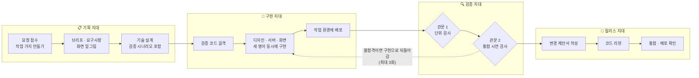
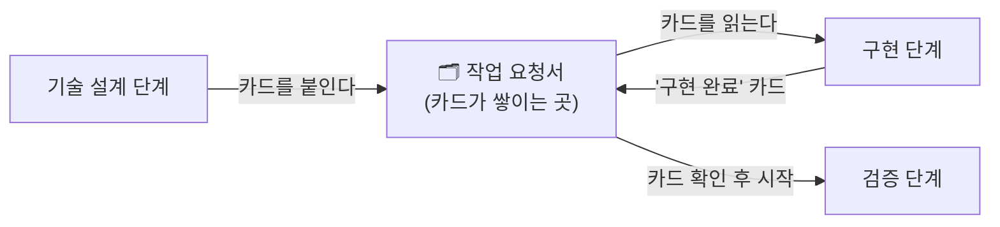
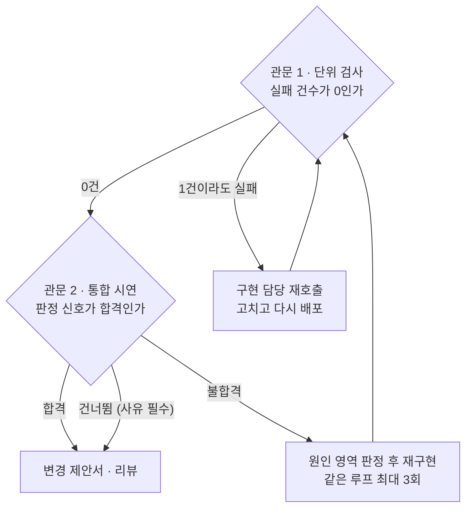
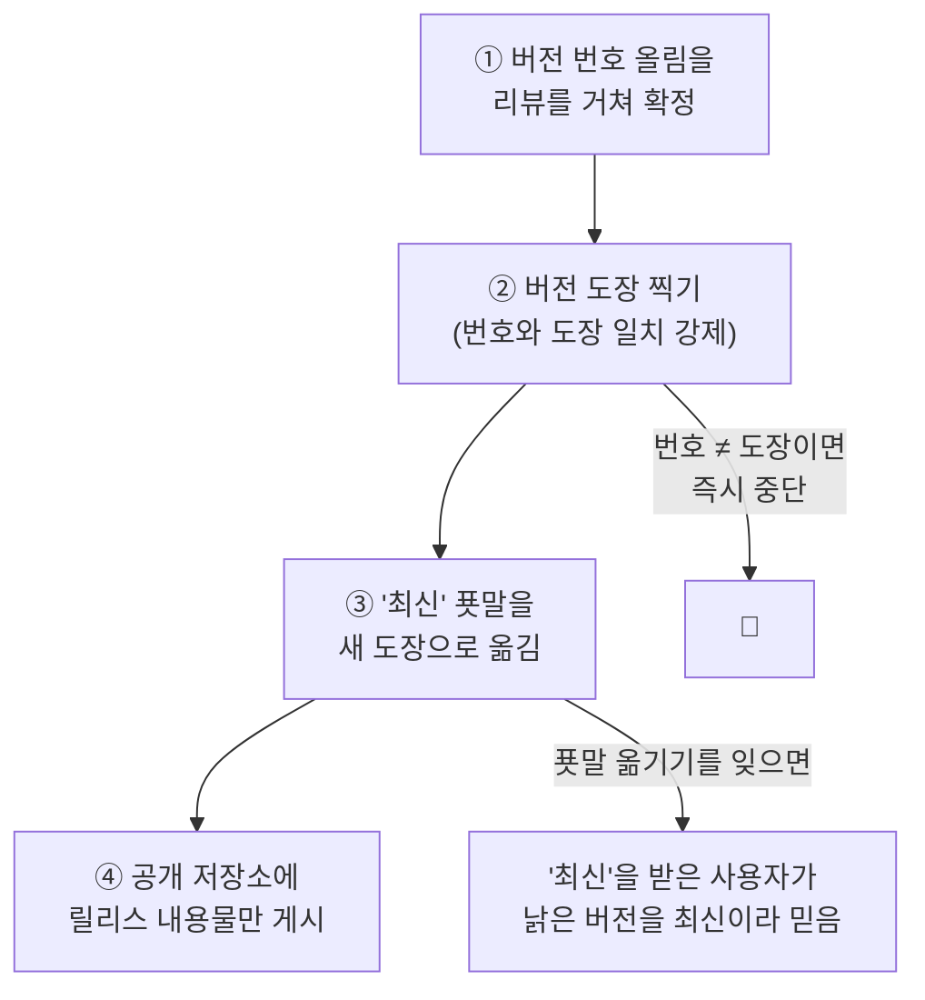

# aiops — 혼자서도 팀처럼 개발하게 해 주는 작업 진행 도구

> **누구를 위한 문서인가**: 개발 지식이 없는 동료·고객·경영진. 파일 경로가 아니라
> **일이 어떻게 흘러가고, 왜 그렇게 만들었는지**를 설명한다.
> 개발자용 상세는 [`../USAGE.md`](../USAGE.md)와 [`../../README.md`](../../README.md)에 있다.
>
> **이 문서가 진실원천과 어긋나면 그쪽이 맞다** — 수치·정책의 정본은 `docs/USAGE.md`와
> 각 스킬 정의 파일이다.

aiops 는 서비스가 아니라 **도구 상자**다. AI 비서(Claude Code)에 꽂아 쓰는 확장 꾸러미로,
"기능 하나 만들어 줘"라는 요청을 **기획 → 설계 → 구현 → 검증 → 배포 확인**까지
정해진 순서로 끌고 간다. 한 사람이 운영해도, 각 단계의 판단 근거가 **기록으로 남는다.**

이 도구가 집착하는 것은 두 가지다:

1. **모든 산출물에 근거를 남긴다** — 단계마다 작업 요청서(이슈)에 기록 카드를 붙인다.
2. **"초록불 = 검증됨"이 아니다** — 관문마다 숫자로 된 통과 조건이 있고, 건너뛰면 사유가 남는다.

---

## 01 · 여정 — 요청 하나가 배포 확인까지 가는 길

**기능 요청 하나는 네 개 지대를 차례로 지나며, 지대를 넘을 때마다 기록이 남는다.**

- 기획 지대의 산출물(요구사항·설계)이 없으면 구현 지대로 못 넘어간다 —
  "나중에 왜 이렇게 만들었는지 아무도 모르는" 사고를 여기서 막는다.
- 구현은 세 역할(디자인·서버·화면)이 **동시에** 진행한다. 순서대로 기다리지 않는다.
- 검증 지대의 두 관문을 모두 통과해야 릴리스 지대에 들어간다.

## 02 · 기록 카드 — 단계와 단계를 잇는 접착제

**다음 단계는 앞 단계의 보고를 믿는 게 아니라, 붙여 둔 기록 카드를 직접 읽고 시작한다.**

각 단계는 끝날 때 작업 요청서(이슈)에 정해진 제목의 카드를 붙인다 —
`📝 요구사항`, `⚙️ 기술 설계`, `🚢 배포 완료`, `✅ 검사 합격` 같은 식이다.
다음 단계는 **그 카드가 있는지 먼저 확인**하고, 없으면 진행하지 않는다.

이 카드 제목은 **약속된 인터페이스**라 함부로 바꾸지 않는다. 바꾸면 뒷 단계가 카드를
못 찾아 **조용히 멈춘다** — 시끄러운 실패보다 위험한 종류의 고장이라, 규약으로 못 박았다.
저장소 서비스에 장애가 나면 카드를 레포 안 폴더에 임시 보관했다가 복구 후 옮긴다.

## 03 · 관문 — 통과 조건이 숫자다

**"검사 돌렸고 초록불"이 아니라, 숫자와 판정 신호가 있어야 문이 열린다.**

- 관문마다 요구하는 신호가 다르다: 단위 검사는 **실패 0건**, 통합 시연은 **합격 판정 신호**,
  배포 확인은 **배포된 버전 표식이 방금 내보낸 것과 일치**하는지까지 본다.
- 건너뛰기(`건너뜀`)는 합격과 동등하게 취급하되 **사유를 반드시 기록**한다.
  조용한 건너뛰기는 금지다 — 이 도구의 존재 이유가 "조용한 실패를 없애는 것"이기 때문이다.
- 마지막 관문(운영 배포 확인)이 불합격이면 **자동으로 직전 버전으로 되돌린다.**

## 04 · 릴리스 — 순서를 뒤집으면 조용히 깨진다

**새 버전을 내는 절차는 도장 찍는 순서까지 정해져 있고, 사람 손이 아니라 전용 절차가 소유한다.**

왜 이 순서인가 — 각 단계를 건너뛰었을 때의 사고가 실제로 정의돼 있다:

- **번호와 도장이 어긋나면**: 사용자 쪽 저장 공간이 버전 번호로 구분되기 때문에,
  새 도장을 받아도 **옛 내용을 그대로 쓰면서 성공한 것처럼 보인다.** 그래서 절차가 일치를 강제한다.
- **'최신' 푯말을 손으로 옮기면**: 반드시 잊는다. 잊으면 실패처럼 보이지 않는 사고가 난다.
  그래서 푯말 이동이 절차 안에 묶여 있다.
- **공개 게시는 내용물만**: 사내 개발 이력에는 정리 이전의 내부 이름들이 남아 있어,
  이력째 밀지 않고 **릴리스 시점의 내용물만** 공개 저장소에 새로 얹는다.

받아 쓰는 쪽은 두 채널 중 하나를 고른다:

| 채널 | 성격 | 권장 대상 |
|---|---|---|
| **버전 고정** | 그 버전에 못 박힌다. 언제 무엇이 바뀌는지 팀이 통제 | 팀 공유 설정 (권장) |
| **최신 추종** | 새 릴리스가 나오면 따라간다. 단, 자동은 아니고 갱신 조작이 필요 | 먼저 써 보고 싶은 개인 |

최신 추종의 대가도 문서에 정직하게 적혀 있다: 사고 조사 때 "그때 무슨 버전이었나"를
답하기 어렵고, 팀원 간 버전이 갈라질 수 있다.

## 05 · 등장인물 — 누가 무엇을 판단하나

역할을 여럿으로 나눈 이유는 하나다: 한 명이 기획·구현·검증을 다 하면
**자기 일을 자기가 채점**하게 된다. 그래서 검증 역할은 구현 보고를 믿지 않고 **다시 잰다.**

| 역할 | 하는 일 | 비고 |
|---|---|---|
| 총괄 | 단계를 조율하고 위임만 한다 — 직접 구현 금지 | `orchestrator` |
| 기획 리드 | 요구사항·화면 밑그림 | `planning` |
| 개발 리드 | 기술 설계 총괄 | `dev` |
| 구현진 | 서버·화면·디자인·배포·검증 골격·제안서 작성 | `dev-backend` 외 |
| 모바일 구현진 | 4개 프레임워크별 전담 | `dev-mobile-*` |
| 검증진 | 단위 검사·통합 시연을 **재실측**하고 합격 판정 | `qa-*` |
| 버그 담당 | 재현·원인 분석 / 수정 전후 증거 확인 | `bug-analyst` 외 |
| 릴리스 관리자 | 통합·정리·문서 갱신 | `release-manager` 외 |
| 저장소 심부름꾼 | 이슈·제안서·리뷰 조작. 저장소 서비스 종류를 자동 감지 | `forge.sh` |
| 자동 검사 지킴이 | 저장소의 자동 검사가 끝나기를 기다렸다가 결과를 보고 | `actions-wait.sh` |
| 릴리스 절차 | 버전 도장·푯말·공개 게시의 단일 소유자 | `tools/release.sh` |

핵심 숫자 (v1.6.0 기준):

| | |
|---|---|
| 절차(스킬) | **33개** |
| 역할(에이전트) | **25개** |
| 기본 여정 단계 | **11단계** (0~10) |
| 재검증 루프 상한 | **3회** |
| 도구 로드 비용 | 세션당 약 **5,500 토큰** |
| 라이선스 | Apache-2.0 (상업적 사용·수정·재배포 허용) |

## 06 · 프로젝트마다 다시 배운다

이 도구는 특정 기술만 아는 게 아니다. 처음 붙일 때 **설정 절차가 그 프로젝트를 훑어**
무슨 언어·도구를 쓰는지 감지해 적어 두고, 구현·검증 역할들이 그 기록을 읽어 맞춰 움직인다.
감지 기록에 없는 종류의 작업(예: 관리자 화면이 없는 프로젝트의 관리자 검사)은
**"해당 없음: 사유"를 남기고 건너뛴다** — 여기서도 조용한 건너뛰기는 없다.

비밀값(접속 암호·인증 키 등)은 파일이나 코드에 적지 않고 **사내 금고 서비스에서
필요한 순간에만 꺼내 쓰는** 절차가 v1.6.0에 추가됐다. 꺼낸 값은 화면·기록 어디에도
남기지 않고, 보고에는 이름표만 적는다.

## 07 · 설계 원칙 — 일부러 즉시 멈추게 만든 곳들

이 도구는 애매하면 진행하지 않고 **그 자리에서 멈추도록** 만든 지점이 많다.
전부 "조용히 잘못되는 것"을 "시끄럽게 멈추는 것"으로 바꾼 장치다.

- **버전 번호와 도장이 다르면 릴리스 중단** — 어긋난 채 나가면 갱신이 성공처럼 보이며 실패한다.
- **같은 도장으로 두 번 릴리스 금지** — 도장 이력이 곧 감사 기록이라, 릴리스는 언제나 새 도장이다.
- **심부름꾼에게 본문 대신 파일 경로를 잘못 건네면 거부** — 경로 문자열이 본문으로
  등록되던 실제 사고를 겪고 만든 방어다.
- **작업 폴더를 재사용하기 전에 작업 가지 이름부터 확인** — 누가 안에서 가지를 바꿔 탔다면
  모르는 사이 본선에 직접 커밋하게 되기 때문이다.
- **특수 배포 단계는 기본이 '끄기'** — 설정이 없으면 "하지 않는 쪽이 안전"을 택한다.
- **건너뛰기에는 반드시 사유** — 사유 없는 건너뛰기는 관문을 통과하지 못한다.

---

### 근거 (이 문서가 읽은 것)

`README.md` · `docs/USAGE.md`(정책 P1~P8, 마커 표, 게이트 표, 한계 절) ·
`aiops/.claude-plugin/plugin.json`(version 1.6.0) · `tools/release.sh`(릴리스 순서·중단 조건 주석) ·
`aiops/scripts/forge.sh`(인증·거부 동작) · `aiops/skills/kms/SKILL.md`(비밀값 절차) ·
스킬 33·에이전트 25는 디렉토리 실측.

정확한 이름 대응: 작업 요청서=이슈, 기록 카드=마커 헤더 댓글, 변경 제안서=Pull Request,
버전 도장=git 태그, '최신' 푯말=`latest` 태그, 저장소 서비스=GitHub/Gitea(forge),
사내 금고=KMS(`/aiops:kms`), 자동 검사=CI(Actions).
